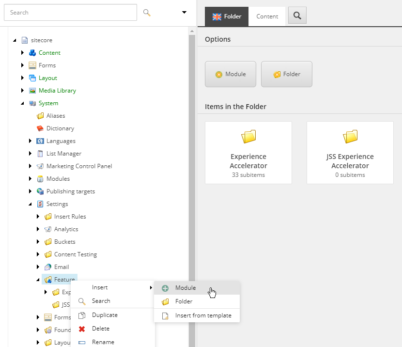
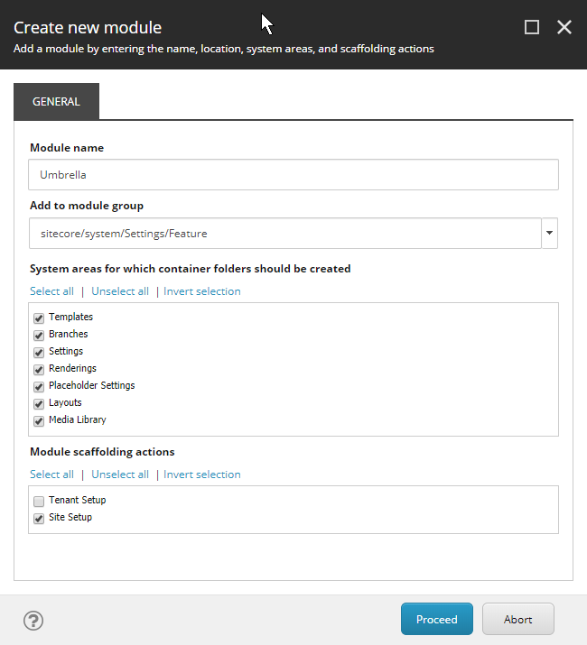
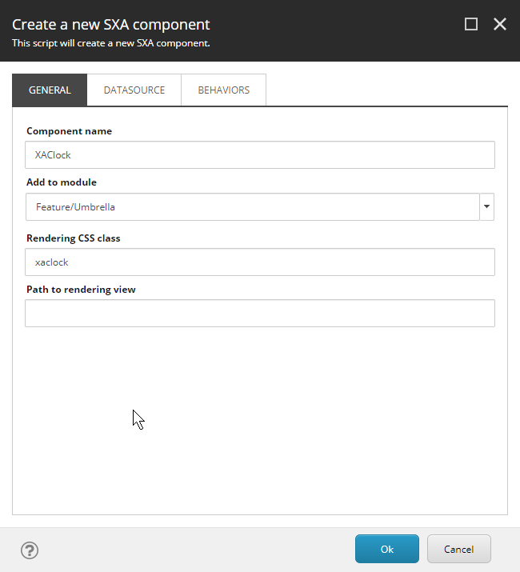
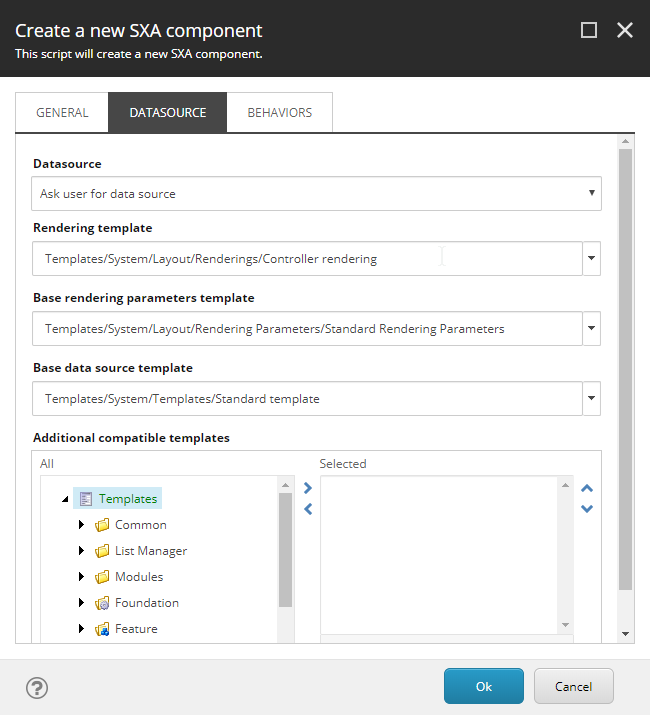
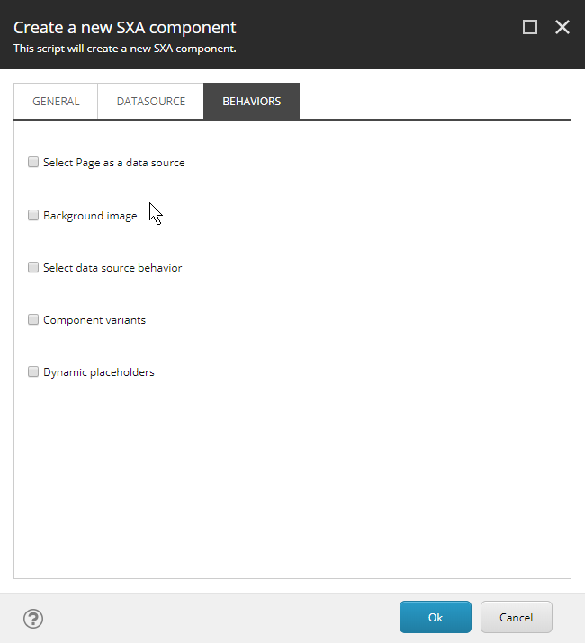
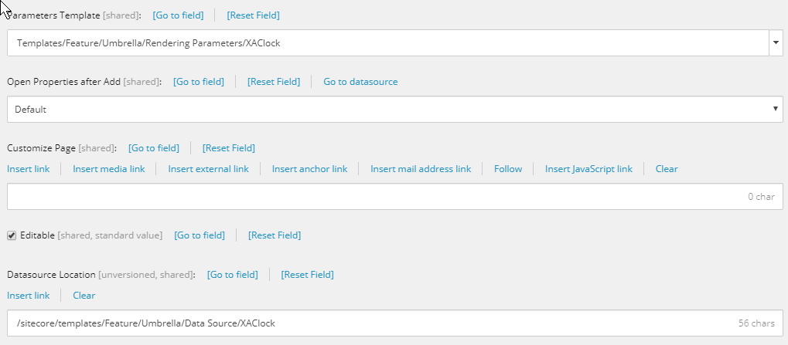
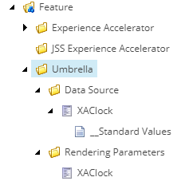
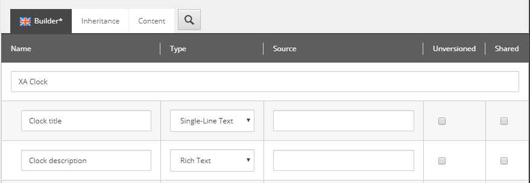
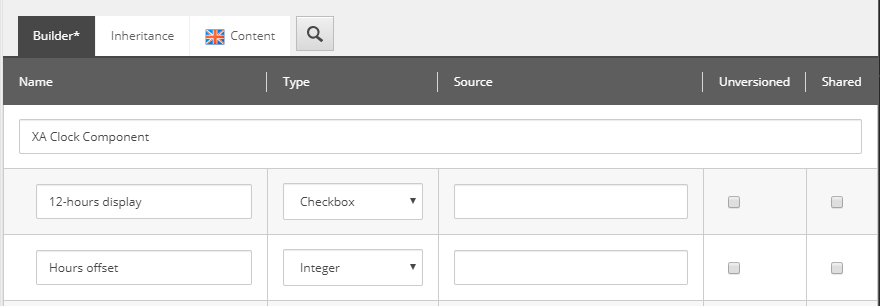

Sitecore provides with SXA a powerful CMS authoring environment with an extensive set of out of the box components (called renderings in Sitecore SXA terms) for designing your web pages. The thing is: this is the Sitecore set of components, and maybe not the set of components you want to design your website with. In this blog post, we explore how to create an *Address Card* renedring (component), and add them to a custom section *Acme Components* in the SXA Toolbox. The approach of creating a custom section prevents that our renderings will be overwritten on an SXA update.

### Creating a new SXA module
An SXA Toolbox section requires an SXA module. An SXA module can be created in the Foundation or Feature layer. This structuring comes from the [Sitecore Helix solution architecture](https://helix.sitecore.net/introduction/index.html), a set of conventions used in Sitecore applications to provide a modular architecture which helps you manage dependencies. In this solution architecture Sitecore Helix defines three layers:


Those layers you will find back in everything Sitecore does. That is why you see folders named [foundation](https://helix.sitecore.net/principles/architecture-principles/layers.html#foundation-layer), [feature](https://helix.sitecore.net/principles/architecture-principles/layers.html#feature-layer) and [project](https://helix.sitecore.net/principles/architecture-principles/layers.html#project-layer) all over the place.

For our case it seems best to create an SXA module on feature level. See the [Create a new SXA module](https://doc.sitecore.com/developers/sxa/93/sitecore-experience-accelerator/en/create-a-new-sxa-module.html) section of the Sitecore documentation on the steps required to create a new Sitecore module. In this example we will name our SXA module _Acme Components_, named after the [fictional Looney Tunes company](https://en.wikipedia.org/wiki/Acme_Corporation).

Execute the following steps to create a new module on feature level:

1. Right-click on `/sitecore/System/Settings/Feature` and select `Insert > Module`
  
2. Name the module `Acme Components` (or your custom name) and for now, we select all system areas for which container folders are created, we never know what more Acme will bring us in the future! We only select the Site level where the module can be scaffolded because renderings do not make sense at the Tenant level.
  

We are now ready to add the newly created (empty) module to our SXA Site.

### Create an SXA site for testing

Create an SXA Tenant **DigitalMarketingPlatform** with all modules, and under his tenant an SXA Site **ComponentLibrary** on the virtual folder `/ComponentLibrary`, all modules including the newly created **Acme Components** module, the theme **Wireframe** (for now) and the grid **Bootstrap 4**.

Now we have our environment ready to add a new rendering.

When you already have an SXA site, add the *Acme Modules* module to the site as described in the Sitecore documentation [Add a module to an existing tenant or site](https://doc.sitecore.com/developers/sxa/93/sitecore-experience-accelerator/en/add-a-module-to-an-existing-tenant-or-site.html)

### Add a custom rendering

All renderings are located  in `/sitecore/Layout/Renderings`. The out of the box SXA renderings can be found in the sub-folder `Feature/Experience Accelerator`. We will create our components in the new created `Feature/Acme Components` sub-folder.

The easiest and preferred way of creating a new rendering is by cloning an existing rendering.

#### Clone a rendering

If you need a rendering with **Rendering Parameters** only, clone the **Page Content** rendering by right-clicking on `/sitecore/layout/Renderings/Feature/Experience Accelerator/Page Content/Page Content` and selecting `Scripts > Clone Rendering`.

If you need a rendering with **Rendering Parameters & Data Source** clone the **Promo** rendering `/sitecore/layout/Renderings/Feature/Experience Accelerator/Page Content/Promo` using `Scripts > Clone Rendering`

  
In this example we will create a rendering for an *Address Card* and 
Right-click the `Umbrella` folder and select `Insert > Component` as described in the `Use the Component wizard to create a custom rendering` section of the Sitecore documentation. Check this documentation for details on the fields. Note that all fields can be set afterwards as well.

We use the following settings in the wizard screens:


Keep the path to the rendering view empty.


Keep the default values for now. Note that it is possible to specify other templates to create our XAClock clock for the rendering parameters and the data source.


Keep the default values for now.

The wizard creates a new item `Umbrella/XAClock` where many of the settings can be changed afterwards. In this item we see that the *Parameters Template* and the *Datasource Location* point to an XAClock specific version.




These entries are also created:


### Configuring the XAClock component

The next step is to configure all elements of our new XAClock component.

We need to configure:
- The Data Source `/sitecore/templates/Feature/Umbrella/Data Source/XAClock`
- The Rendering Parameters `/sitecore/templates/Feature/Umbrella/Rendering Parameters/XAClock`

#### Data Source configuration



#### Rendering Parameters configuration



### Do we have all elements?

Subitems	
XAClockPromo /sitecore/templates/feature/umbrella/xaclockpromo

Templates	
XAClock: /sitecore/templates/feature/umbrella/rendering parameters/xaclock
XAClock: /sitecore/templates/feature/umbrella/data source/xaclock
XAClockPromo: /sitecore/templates/feature/umbrella/rendering parameters/xaclockpromo
XAClockPromo Folder: /sitecore/templates/feature/umbrella/xaclockpromo folder

Renderings	
XAClock /sitecore/layout/renderings/feature/umbrella/xaclock
XAClockPromo /sitecore/layout/renderings/feature/umbrella/xaclockpromo

System	
Add XAClockPromos Data Item: /sitecore/system/settings/feature/umbrella/umbrella site setup/add xaclockpromos data item
XAClockPromo: /sitecore/system/settings/feature/umbrella/umbrella site setup/rendering variants/xaclockpromo

Branches	
Default XAClockPromo Variant: /sitecore/templates/branches/feature/umbrella/default xaclockpromo variant


### Create a default rendering variant

Our new XAClock component does nothing yet. To get some output we need a default rendering variant.

1. Right-click `/sitecore/Templates/Branches/Feature/Umbrella` and select `Insert > New Branch`. We now need to select a new branch template. Go to `Branches/Feature/Experience Accelerator` and select the `Page Content` as the new branch template.

### 
### Using our new created module in a site

The next step is to add our new `Umbrella` module to our SXA site. Right-click on the SXA site, select  `Scripts > Add Site Module` and add the `Umbrella` module.

Especially during development we want to re-add our `Umbrella` module again to our site. Normally this is not possible, but this [StackExchange](https://sitecore.stackexchange.com/questions/16766/re-adding-site-module-to-install-new-sxa-components) article describes how it can be done (with some caviats).
When I followed their steps and re-added the Umbrella module the script executed succesfuly, but the Item was not added. I looked into the logs (in folder `C:\inetpub\wwwroot\sergesc.dev.local\App_Data\logs\` on my machine) - the latest `SPE.log.xxxxxx.txt` log file - and found the issue: 

```
ERROR Error while executing NewItem(string path='master:\content\SergeTenant\SergeSxaSite\Umbrella', string itemTypeName='/sitecore/templates/Branches/Feature/Umbrella/Available  Renderings', string newItemValue='')
Exception: Sitecore.Exceptions.DuplicateItemNameException
Message: The item name "Umbrella" is already defined on this level.
```

This needs some more investigation, so I downloaded [BareTail](http://www.baremetalsoft.com/baretail/index.php) - a small, simple and powerful log file viewer that can monitor multiple files. 

After deleting the item `/content/SergeTenant/SergeSxaSite/Umbrella` and for each component in our module the corresponding item in the folder `/sitecore/content/SergeTenant/SergeSxaSite/Presentation/Rendering Variants` (with **Action** set to **Remove links** - it's rendering variant children point to the parent item) I could successfully re-add the `Umbrella` module. 


