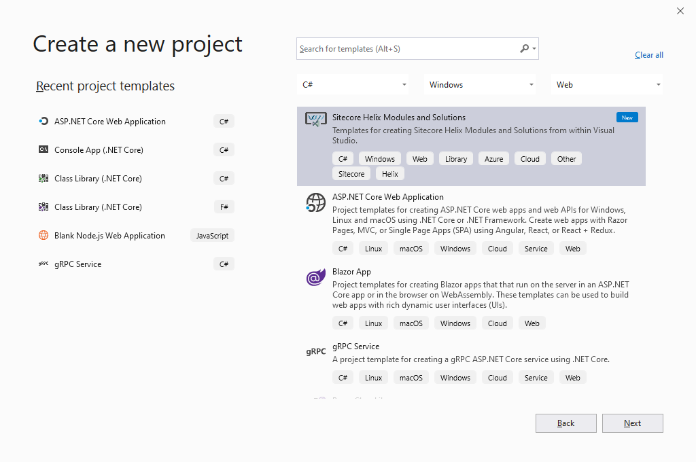
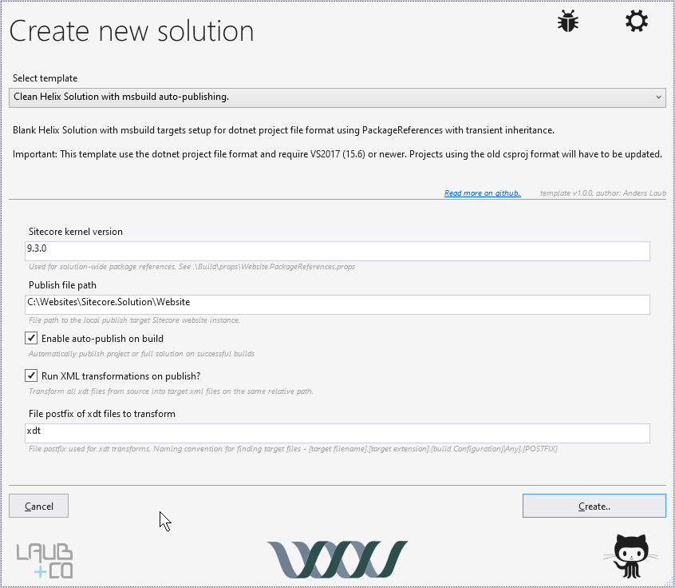
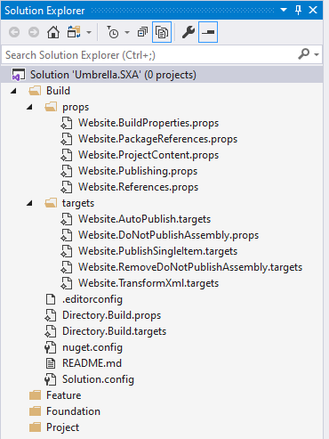
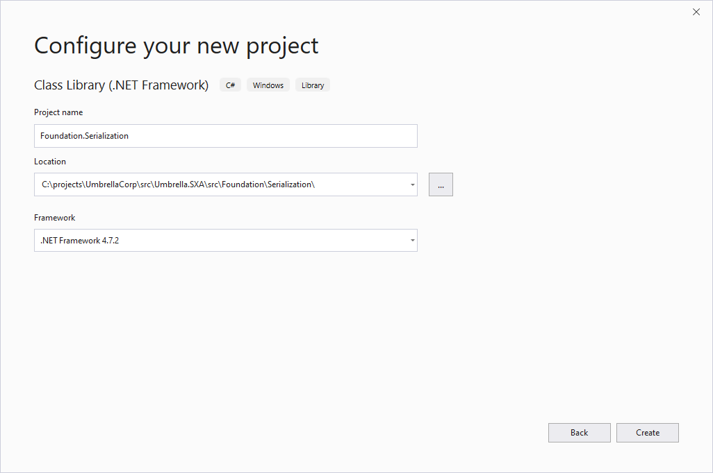

In this post I record the steps I took in setting up a new Sitecore 9.3 SXA project using the Sitecore Helix Visual Studio Templates. The setup is inspired by the great sample website provided by [Mark van Aalst](http://www.markvanaalst.com/) on his GitHub repositories [SXA.Styleguide](https://github.com/markvanaalst/SXA.Styleguide) and [SXA.Styleguide.Frontend](https://github.com/markvanaalst/SXA.Styleguide.Frontend).

### Creating the initial project structure

When creating bigger projects I prefer to create an extra level in my folder structure instead of the default structure created when using Visual Studio to create a new solution. The reason is that the Visual Studio solution with its Visual Studio projects is not the only part of a bigger project.

Let say we create a new project for a victuous company called **UmbrellaCorp**. We create a folder structure as follows:

- **c:\projects\UmbrellaCorp**
  - **pipeline**
    - *this folder will contain all required DevOps pipeline configuration files* 
  - **src**
    - *this folder will contain all source code*
  - **.editorconfig**
  - **.gitattributes**
  - **.gitignore**

### Installing the Sitecore Helix Visual Studio Templates

[Laub + CO](https://github.com/LaubPlusCo) has created a great Visual Studio extension called [*Sitecore Helix Visual Studio Templates*](https://marketplace.visualstudio.com/items?itemName=AndersLaublaubplusco.SitecoreHelixVisualStudioTemplates) for creating a Helix architecture based Visual Studio solution.See the [documentation on this extension](https://github.com/LaubPlusCo/LaubPlusCo.Helix.VsTemplates/blob/master/README.md) for more details on the extension, how to install it, and an important one: how to make sure that your Visual Studio always start as administrator, which is required to use this extension.

Inspired on his documentation:

Guide to always start Visual Studio as administrator (assuming Windows 10 and Visual Studio 2019): 
1. Press the "Windows"key and search for "Visual Studio 2019"
2. Right click on the resulting item and select "Open file location"
3. Right click a the selected shortcut to "Visual Studio 2019"
4. Select "Properties"
5. Click "Open File Location"
6. Right click "devenv.exe"
7. Select "Troubleshoot compatibility"
8. Select "Troubleshoot program"
9. Check "The program requires additional permissions"
10. Click "Next"
11. Click "Test the program..." which open Visual Studio 2019
12. Close Visual Studio
13. Press "Next"
14. Select "Yes, save these settings for this program"
15. Click "Close"


After installing the extension open Visual Studio and create a new project.



Select the *Sitecore Helix Modules and Solutions* project template.



This results in the following initial solution structure:



### Customizing the generated project files

The generated solution structure assumes that Sitecore 9.1.0 is used. In our case we are using Sitecore 9.3.0, so we need to make some modifications to fix this.

In fixing I also looked at the configuration made by Mark van Aalst on his GitHub repository [SXA.Styleguide](https://github.com/markvanaalst/SXA.Styleguide), he has been working together with other rockstars to get that configuration correctly.

I made the following changes:

1. `Build/props/Website.BuildProperties.props`:
  Comment out the following lines:
  ```
  <OutputPath>$(SolutionDir)\bin\website\$(Configuration)\</OutputPath>
  <OutDir>$(OutputPath)</OutDir>
  <UseCommonOutputDirectory>True</UseCommonOutputDirectory>

  <!-- Set solution-wide config file for binding redirects -->
  <AppConfig>$(SolutionDir)\build\Solution.config</AppConfig>
  ```

2. `Build/props/Website.BuildProperties.props`:
  Update to version 9.3.0 for the correct Sitecore version:
  ```
  <PackageReference Include="Sitecore.Kernel" Version="[9.3.0]" />
  <PackageReference Include="Sitecore.Mvc" Version="[9.3.0]" />
  ```

A great next step is to read the following blog posts by Izabela Wlodarska:

- [Getting started with Unicorn serialization for Sitecore – Part 1](http://www.izabelawlodarska.com/2018/11/24/getting-started-with-unicorn-serialization-for-sitecore/)
- [Getting started with Unicorn serialization for Sitecore Experience Accelerator (SXA) – part 2](http://www.izabelawlodarska.com/2019/01/07/getting-started-with-unicorn-serialization-for-sitecore-experience-accelerator-sxa-part-2/)

Especially in the second post, she gives a lot of guidance on how to organize the configuration of Unicorn to sync SXA items.

Because the guidance of Izabela Wlodarska also inspired the setup of the [SXA.Styleguide]() project by Mark van Aalst, I look at that solution as well in taking the next steps of creating the solution setup of the Umbrella.SXA solution for UmbrellaCorp.

### Add Unicorn support to the solution

For Unicorn support, we need to install the Unicorn NuGet package for a project on the Foundation level. Because this project is about serialization, we create a folder `Serialization` within the `Foundation` folder (on the filesystem). Note that this must be matched by a solution folder `Serialization` under `Foundation` as well. In the `Serialization` solution folder we create a .Net Framework Class Library project `Foundation.Serialization` which should be located under the filesystem folder `src\Umbrella.SXA\src\Foundation\Serialization`



On the `Foundation.Serialization` folder we add the NuGet package `Unicorn`.

After installation a `readme.txt` file in shown in Visual Studio with an explanation of the next steps:

*First, you should set up a configuration. This tells Unicorn what you want to keep serialized, among other things. 
Make a copy of App_Config/Include/Unicorn/Unicorn.Configs.Default.example and rename it to .config. You can place this file anywhere in App_Config/Include, such as Include/MySite/Unicorn.Configs.MySite.config.*

I had a hard job finding the location of the (sample) Unicorn configuration files, until I right-clicked the `readme.txt` file tab and selected the action "Open containing folder". This folder is in my case `C:\Users\serge\.nuget\packages\unicorn\4.1.2-pre2`. In this folder is a folder `content` containing the required files.

1. Copy the folder `App_Config` to the project `Foundation.Serialization`
2. Navigate to the folder `App_Config\Include\Unicorn` in the Visual Studio Solution Explorer and copy the file `Unicorn.Configs.Default.example` to `Unicorn.Configs.Default.config`
3. On the file properties of `Unicorn.Configs.Default.config` 


    