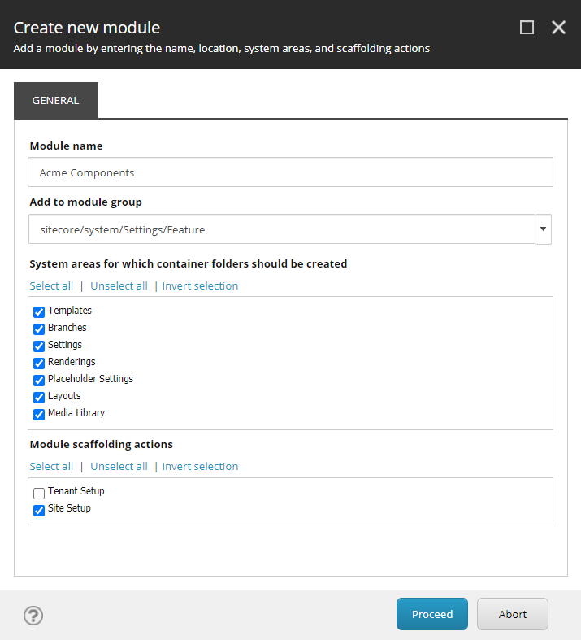
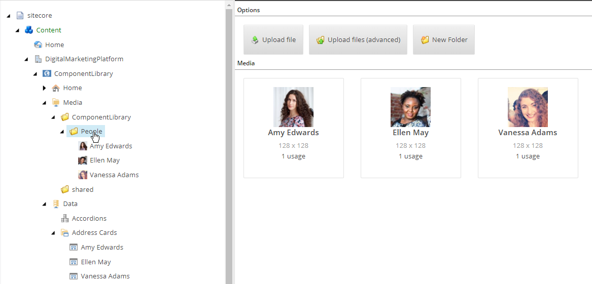

Sitecore provides with the Sitecore eXperience Accelerator (SXA) a powerful CMS authoring environment with an extensive set of out of the box components (called renderings in Sitecore SXA terms) for designing your web pages. The thing is: this is the Sitecore set of components, and maybe not the set of components you want to design your website with. In this blog post, we explore how to create an *Address Card* rendering (component), and add the rendering to a custom section *Acme Components* in the SXA Toolbox.

### Introduction
Sitecore developers often think that their C# development skills are required to create new renderings for Sitecore SXA, as they were needed in "classic" Sitecore projects to create the required controller rendering.

In this post I described how to create:
- A new SXA Toolbox section
- A Sitecore module
- A custom rendering
- A rendering variant for our custom rendering using Scriban

Without writing any C#. 

I have no idea why this approach is not described in the Sitecore documentation. If you look at the documentation [Walkthrough: Building a simple rendering](https://doc.sitecore.com/developers/sxa/93/sitecore-experience-accelerator/en/walkthrough--building-a-simple-rendering.html) you will see that Sitecore still describes the usage of a lot of C# code and plumbing. 

### Creating a new SXA module
For the new SXA Toolbox section we create a corresponding new SXA module so it can be enabled on a site and will not lead to a collision in a Sitecore upgrade. A SXA module can be created in the *Foundation* or *Feature* layer. This structuring comes from the [Sitecore Helix solution architecture](https://helix.sitecore.net/introduction/index.html), a set of conventions used in Sitecore applications to provide a modular architecture which helps you manage dependencies. In this solution architecture Sitecore Helix defines three layers:


Those layers you will find back in everything Sitecore does. That is why you see folders named [foundation](https://helix.sitecore.net/principles/architecture-principles/layers.html#foundation-layer), [feature](https://helix.sitecore.net/principles/architecture-principles/layers.html#feature-layer) and [project](https://helix.sitecore.net/principles/architecture-principles/layers.html#project-layer) all over the place.

For our case it seems best to create a SXA module on feature level. See the [Create a new SXA module](https://doc.sitecore.com/developers/sxa/93/sitecore-experience-accelerator/en/create-a-new-sxa-module.html) section of the Sitecore documentation for more details on the steps required to create a new Sitecore SXA module. In this example we will name our SXA module _Acme Components_, named after the [fictional Looney Tunes company](https://en.wikipedia.org/wiki/Acme_Corporation).

Execute the following steps to create a new module on feature level:

1. Right-click on `/sitecore/System/Settings/Feature` and select `Insert > Module`
  
2. Name the module `Acme Components` (or your custom name) and for now, we select all system areas for which container folders are created, we never know what more Acme will bring us in the future! We only select the `Site Setup` where the module can be scaffolded because renderings do not make sense at the Tenant level.
  

We are now ready to add the newly created (empty) module to our SXA Site.

### Create an SXA site for testing

When you don't have an SXA Site available to test out the new SXA module, create an SXA Tenant **DigitalMarketingPlatform** with all modules, and under his tenant an SXA Site **ComponentLibrary** on the virtual folder `/ComponentLibrary`, all modules including the newly created **Acme Components** module, the theme **Wireframe** (for now) and the grid **Bootstrap 4**.

Now we have our environment ready to add a new rendering.

When you already have a SXA site, add the *Acme Modules* module to the site as described in the Sitecore documentation [Add a module to an existing tenant or site](https://doc.sitecore.com/developers/sxa/93/sitecore-experience-accelerator/en/add-a-module-to-an-existing-tenant-or-site.html).

### Add a custom rendering

All Sitecore SXA renderings are located  in `/sitecore/Layout/Renderings`. The out of the box SXA renderings can be found in the sub-folder `Feature/Experience Accelerator`. We will create our components in the new created `Feature/Acme Components` sub-folder tp prevent collision with Sitecore and upgrades.

The easiest and preferred way of creating a new rendering is by cloning an existing rendering.

#### Clone a rendering

If you need a rendering with **Rendering Parameters** only, clone the **Page Content** rendering by right-clicking on `/sitecore/layout/Renderings/Feature/Experience Accelerator/Page Content/Page Content` and selecting `Scripts > Clone Rendering`.

If you need a rendering with **Rendering Parameters & Datasource** clone the **Promo** rendering `/sitecore/layout/Renderings/Feature/Experience Accelerator/Page Content/Promo` using `Scripts > Clone Rendering`

  
In this example we will create a rendering for an *Address Card* with rendering parameters and datasource:

- Right-click on `/sitecore/layout/Renderings/Feature/Experience Accelerator/Page Content/Promo` and select `Scripts > Clone Rendering`
- In the **Create derivative rendering** window make the following selections:
  - **General** tab:

    | Parameter | Value | Explanation |
    | - | - | - |
    | New rendering name | Address Card | The name of the Rendering |
    | Add to module | Feature/Acme Components | The new module we created to manage our components |
    | Rendering CSS class | addresscard | A CSS class for the component, can be used as a hook to connect functionality to the DOM elements of the component |
  - **Parameters** tab:
  
    | Parameter | Value | Explanation |
    | - | - | - |
    | Rendering Parameters | Make a copy of the original rendering parameters | We want to be able to create our own set of rendering parameters, and not use the rendering parameters of the Promo rendering |
  - **Datasource** tab:
  
    | Parameter | Value | Explanation |
    | - | - | - |
    | Datasource | Make a copy of original datasource | We want to be able to create our own datasource, and not use the datasource of the Promo rendering |
  - **View** tab:
  
    | Parameter | Value | Explanation |
    | - | - | - |
    | View | Use original MVC view file | (unmodified) The Promo view file is a very generic view file and contains everything we need for our new rendering. The only "Promo" specific part is a fallback to a "promo" CSS class if not defined, but we specified the "addresscard" CSS class |
    | Path to rendering view | ~/Views/Variants/Promo.cshtml | (unmodified) The path to the Promo view file |

#### Investigate the created rendering
We now have a new created controller rendering `/sitecore/layout/Renderings/Feature/Acme Components/Address Card`. If we investigate this new rendering we see among other things the following configuration settings:

- The `Controller` is set to `Sitecore.XA.Foundation.RenderingVariants.Controllers.VariantsController,Sitecore.XA.Foundation.RenderingVariants`, this is a generic controller supporting rendering variants.
- The `Datasource Template` is located at `/sitecore/templates/Feature/Acme Components/Address Card`  
- The `Parameters Template` is located at `Templates/Feature/Acme Components/Rendering Parameters/Address Card`
- The `Datasource Location` is set to the query `query:$site/*[@@name='Data']/*[@@templatename='Address Card Folder']|query:$sharedSites/*[@@name='Data']/*[@@templatename='Address Card Folder']` which looks for items in the `Data/Address Card Folder` in both our SXA site and [shared SXA sites](https://doc.sitecore.com/users/sxa/93/sitecore-experience-accelerator/en/share-data-sources-and-presentation-using-the-multisite-feature.html). 

#### Configure the datasource
The next step is to configure the fields for the datasource. Navigate to `/sitecore/templates/Feature/Acme Components/Address Card`, and you will see that a copy of the `Promo` section with corresponding template fields is created. In the `Builder` tab it is very easy to change the Promo section name and template fields into what we need for our address card.

I made the following changes:

Before:


After:


Rendering datasource configuration summary:

Section name: **Address Card**

| Name | Type | Source |
| - | - | - |
| Name | Single-Line Text | |
| Image | Image | query:$siteMedia |
| Address | Single-Line Text | |
| Latitude | Single-Line Text | |
| Longitude | Single-Line Text | |
| Email | Email | |
| Phonenumber | Single-Line Text | |

Note that if you modify the existing template field items from Promo you need to make changes to the settings on the template field item itself as well, like setting the `Data:Title` field to the correct name. The template field items contains many addition options like default value, validation and search configuration.

#### Configure the parameters
To configure the parameters, open the `Builder` tab of the item `/sitecore/templates/Feature/Acme Components/Rendering Parameters/Address Card`. The configuration is initially empty, but as soon as you add a new section, e.g. *Address Card*, new fields can be added:


Rendering parameters configuration summary:

Section name: **Address Card**

| Name | Type | Source |
| - | - | - |
| AddressIsLink | Checkbox | |
| PhonenumberIsLink | Checkbox | |

Afterward, I changed the title on the Address Card template field items to `Address is link` and `Phonenumber is link`, so the internal names are without spaces but the display names are with spaces.

### Add custom rendering to available renderings
The next step is to make our new rendering available to the Experience Editor toolbox in SXA. We want to have a custom toolbox section *Acme Components* with our new rendering *Address Card*.

The Experience Editor toolbox is completely customizable per SXA site. Right-click on `/sitecore/content/DigitalMarketingPlatform/ComponentLibrary/Presentation/Available Renderings` (path may vary for your site), and select `Insert > Available Renderings`. As name for the new item use `Acme Components`, the name of the new toolbox section. The new created item contains a section `Data:Renderings` with an `Edit` link. When you click this edit link an item sector pops up that enables you to select the `Address Card` rendering from `Renderings/Feature/Acme Components/Address Card`.


The new rendering is now draggable onto the page, and when no datasource item is connected yet has a fallback rendering of the name of the rendering, e.g. `[Address Card]:


When we select `More > Edit component properties` the created rendering parameters are available:


### Add an Address Cards datasource folder
When we add Address Cards to our pages, we need a folder under the SXA site to hold the datasource items, and create some sample items.
Right-click on `/sitecore/content/DigitalMarketingPlatform/ComponentLibrary/Data` (path may vary for your site), and select `Insert > Insert from template`. Select the template `/Feature/Acme Components/Address Card Folder` template, and name it `Address Cards`.

Right-click on the new created Address Cards folder `/sitecore/content/DigitalMarketingPlatform/ComponentLibrary/Data/Address Cards` and select `Insert > Address Card` to create new datasource items.

I created three sample address card items with the following data:

| Name | Image | Address | Latiture | Longitude | Phonenumber |
| - | - | - | - | - | - |
| Amy Edwards |  | 1212 Omaha Dr, Montgomery, AL 36105, United States | 32.1479602 | -85.0162703 | +1 334-280-0960 |
| Ellen May |  | 610 Valley View Ln, Farmers Branch, TX 75234, United States | 32.923308 | -96.892596 | +1 972-919-2620 |
| Vanessa Adams |  | 1118 W Fullerton Ave, Chicago, IL 60614, United States | 41.9243558 | 87.657001 | +1 773-472-4873 |

For the images I created a folder `` as shown below. From the datasource items I browsed to these images to link them to the address cards:



I provided the above data because I know how much work it is to find good sample data. I used this same dataset in a web components experiment that can be found [here](https://mango-river-020e4d803.azurestaticapps.net/).

### Create rendering variants
Although the fallback rendering of our address card as `[Address Card]` is beautiful in its simplicity, we might want a more advanced version showcasing the values of our datasource and the influence of our parameters.

We can accomplish this by creating a *Rendering Variant*.
Right-click on `/sitecore/content/DigitalMarketingPlatform/ComponentLibrary/Presentation/Rendering Variants` (path may vary for your site), and select `Insert > Variants`. As name for the item use *Address Card*, the name of your rendering.

On this new created rendering variant we can add *Variant Definitions*. These are one or more definitions on how to visualize our rendering.
Right-click on `/sitecore/content/DigitalMarketingPlatform/ComponentLibrary/Presentation/Rendering Variants/Address Card` (path may vary for your site), and select `Insert > Variant Definition`. As a name for the item use *Plain*, the name of a variant definition. In future blog posts I will explain how to create more advanced versions of the address card. This whole process and all configuration options on the rendering variant is perfectly explained in the Sitecore documentation [Create a rendering variant](https://doc.sitecore.com/developers/sxa/93/sitecore-experience-accelerator/en/create-a-rendering-variant.html).

Although Sitecore provides many ways to present a visualization of data within a rendering variant, in my opinion [Scriban templates](https://doc.sitecore.com/developers/sxa/93/sitecore-experience-accelerator/en/scriban-templates.html) should be used where possible. Scriban is a more developer-oriented approach where you write code in the Scriban template language that makes most other options obsolete. In my experience rendering variants are created by developers who want to work in a structured way and use versioning and source-control, instead of clicking together Sitecore items for every HTML element they want to render. 

For more information on working in a structured way with Scriban supporting real development tools like Visual Studio Code, source-control and team development have a look at the following projects:

- [SXA CLI](https://doc.sitecore.com/developers/sxa/93/sitecore-experience-accelerator/en/add-a-theme-using-sxa-cli.html) - by Sitecore
- [SXA Umbrella](https://github.com/macaw-interactive/sxa-umbrella#sxa-umbrella) - my take on a more enhanced approach to the SXA CLI functionality with better team development support (plug plug)

#### Scriban template
On the rendering variant Scriban item set the `VariantDetails:Template` field to the following template code:

```
<div>
  <h2>Address Card</h2>
  <hr/>
  <div>Name: <span>{{i_item.Name}}</span></div>
  <div>{{i_item.Image}}</div>
  <div>Address: <span>{{i_item.Address}}</span></div>
  <div>Email: <span>{{i_item.Email}}</span></div>
  <div>Phonenumber: 
  {{ if !o_pagemode.is_experience_editor_editing && 
     (sc_parameter 'PhonenumberIsLink') }}
     <a href="tel:{{ i_item.Phonenumber }}">{{ i_item.Phonenumber }}</a>
  {{ else }}
     <span>{{i_item.Phonenumber}}</span>
  {{ end }}
  </div>
</div>
```

This will result in the following component:


The fields in the card are content-editable.

As you can see in the Scriban code above, rendering parameters can be read through `sc_parameter 'PhonenumberIsLink'`.

When not in the Experience editor the result will be as follows when the `PhoneNumber is link` checkbox is enabled:


### Division of work: Sitecore developer, Sitecore specialist, Front-end developer
Given a Sitecore project we see multiple roles involved like backend developers for the integration with other systems, Sitecore developers for extending Sitecore, Sitecore specialists for configuring Sitecore and front-end developers to create the HTML, CSS and JavaScript that makes the websites shine and fly. And this list does not yet include the search specialist, infrastructure specialist, support engineer, cloud genius, business consultant, content architect, UX specialist, SEO/SEA specialist and designer!

Development for Sitecore SXA is a bit blurrier... who is taking care of creating new renderings, who configures the datasources and parameters, who writes the Scriban templates and where does the role of the front-end developer stops. In my opinion the Scriban templates should be the place where the Sitecore specialist who knows about the renderings, rendering variants and the data, and the front-end developer who knows about the required HTML markup, come together and work together. The Scriban templates should contain the HTML markup as described by the front-end developer (preferably documented in for example [Storybook](https://storybook.js.org/)) bound to the data from Sitecore, but should not contain any styling and functionality.

### Conclusion
In this post I described how to create a Sitecore module, a new SXA Toolbox section, a custom rendering and a rendering variant for our custom rendering using Scriban **without writing any C#**. 

All created Sitecore items can be serialized using a tool like [Unicorn](https://github.com/SitecoreUnicorn/Unicorn) or in the case of Sitecore 10 using [Sitecore Content Serialization](https://doc.sitecore.com/developers/100/developer-tools/en/sitecore-content-serialization.html).

In future posts I will expand on how to make the address card more interactive, style the address card and make the front-end developer and the Sitecore specialist work together in the most optimal way. 


