Sitecore SXA is a great way forward in structuring the way of building Sitecore web sites, providing a set of standard renderings and provide an editing experience for the web site maintainers. But sooner than later you want to extend/replace the out-of-the-box set of renderings, calling in the front-end developers to do their magic. At that moment there are many ways they can do their work, and in this post I will describe in what is in my opinion the optimal way for performance, SEO, front-end developer experience, and separation of concerns.

## Introduction
A good Sitecore SXA project needs good front-end developers, and good front-end developers don't write ASP.NET Razor views and jQuery. We already had this problem a few years ago when we were done by the workflow of front-end developers writing a site mockup in HTML with SASS, and jQuery for the interactive elements, and back-end developers translating this into ASP.NET Razor views. That has not even the worst part - the trouble of keeping the changes to the often extensive amount of HTML in the mockup site in sync with the Razor views was the really bad part.

## ReactJS.NET - those were the days...
Because ReactJS + TypeScript was our defacto standard at that time we decided to write ReactsJS components, have a generic view controller render these React components on the server-side using [ReactJS.NET](https://reactjs.net/), and hydrate on the client-side for interaction.
As shown on the ReactJS.NET website you will get ASP.NET CSHTML Razor pages with code like:

```c#
<!-- This will render the component server-side -->
@Html.React("CommentsBox", new {
    initialComments = Model.Comments
})


<!-- Initialise the component in JavaScript too -->
<script crossorigin src="https://cdnjs.cloudflare.com/ajax/libs/react/16.13.0/umd/react.development.js"></script>
<script crossorigin src="https://cdnjs.cloudflare.com/ajax/libs/react-dom/16.13.0/umd/react-dom.development.js"></script>

@Scripts.Render("~/bundles/main")
@Html.ReactInitJavaScript()
```

This approach works quite well, and my colleague [Sander Boekenoogen](https://www.linkedin.com/in/sander-boekenoogen-aa4a4691/) even solved the puzzle to support dynamic placeholders within the React rendering.
But there are also some down-sides to this approach:

- You need to know what you are doing, like picking the best JavaScript engine for the server-side ReactJS rendering - use the V8 one!
  
- The server-side rendering runs on the same server and in the same process as your Sitecore ASP.NET code

- Sitecore websites still run on ASP.NET full framework, so still "the old stuff", no .NET Core

- It is impossible to debug the server-side ReactJS rendering, and ReactJS will work differently on server-side than in the browser

- Often the same bundle is used on server-side and on client-side, and this bundle can become big - building multiple bundles for server-side and client-side, with lazy loading on the client-side makes the whole process even more complex

- I don't trust the use of jQuery-based components as child components within a ReactJS-based component 

- ReactJS want to control the DOM within its components, having "alien" DOM elements as children are not the best thing to do. I know it can work as described in [How to Use jQuery Inside a React Component](https://app.pluralsight.com/guides/how-to-use-jquery-inside-a-react-component) and [How do I use jquery in react app?](https://medium.com/@kingrayhan/how-do-i-use-jquery-in-react-app-976c124f5448), and we do it sometimes to wrap important components not available in a ReactJS version, but we prefer not to.

## It's a new dawn...
To quote [Michael Bublé](https://www.youtube.com/watch?v=Edwsf-8F3sI): 
>"It's a new dawn. It's a new day. It's a new life. For me…"

The big selling point of Sitecore SXA is its extensive set of out-of-the-box components, which gets even bigger when implementing Sitecore Commerce. These components are not the most modern and flexible components, written using jQuery and KnockoutJS (used in the search components and the SXA storefront). Front-end developers need to be able to write additional components in a modern way, but they should be able to work together with components written "in the old days", so using jQuery and KnockoutJS. Meet web components. What are web components? As described on webcomponents.org:

>Web components are a set of web platform APIs that allow you to create new custom, reusable,
>encapsulated HTML tags to use in web pages and web apps. Custom components and widgets build on the
>Web Component standards, will work across modern browsers, and can be used with any JavaScript library
>or framework that works with HTML.

## What about web components and browser support?
Although my personal opinion is that we should support only modern browsers, so no more Internet Explorer 11 (it was released in 2013!), we have many customers that still want to be able to support Internet Explorer 11. Older versions of Internet Explorer are in my opinion a no-go, except if it is a very deliberate choice, and the customer is willing to pay for the extra effort (and the mental damage). A good example was a car tire company that still got many orders from Windows XP machines they installed in car garages. On these machines, all orders were done through Internet Explorer 8.

Back to Internet Explorer 11... It has no support for web components, but there is a good polyfill to make the custom elements part of web components work on Internet Explorer 11. I think this is good enough. Optimized for modern browsers, but still working on Internet Explorer 11.

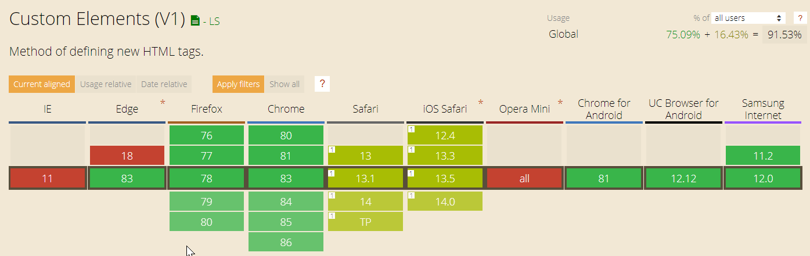

## What does a web component look like?
There are multiple ways to write web components, but in the end, a web component is an addition or extension of the set of available HTML elements and can be used just like a normal HTML element:

```html
<popup-info 
  img="img/alt.png" 
  data-text="Your card validation code (CVC)
             is an extra security feature — it is the last 3 or 4 numbers on the
             back of your card.">
</popup-info>
```

and the good thing is: web components are part of existing web standards, it is not just another framework that comes and goes.

Web components are based on four main specifications as described here, and quoted below:

**Custom Elements** - The [Custom Elements specification](https://w3c.github.io/webcomponents/spec/custom/) lays the foundation for designing and using new types of DOM elements

**Shadow DOM** - The [Shadow DOM specification](https://w3c.github.io/webcomponents/spec/shadow/) defines how to use encapsulated style and markup in web components

**ES Modules** - The [ES Modules specification]() defines the inclusion and reuse of JS documents in a standards-based, modular, performant way

**HTML Template** - The [HTML template element specification](https://html.spec.whatwg.org/multipage/scripting.html#the-template-element/) defines how to declare fragments of markup that go unused at page load, but can be instantiated later on at runtime

## Writing web components
There are multiple ways how you can write web components. In my investigations, I moved from [the plain way as described in the Mozilla documentation](https://developer.mozilla.org/en-US/docs/Web/Web_Components/Using_custom_elements), to using [LitElement](https://lit-element.polymer-project.org/) by the Google Polymer team and advocated by the https://open-wc.org/ team, ending up by [StencilJS](https://stenciljs.com/) by the Ionic team that, in my opinion, provides the most powerful vision and tooling. Another important reason why I chose StencilJS was that I wanted to build web components without using shadow DOM because that is difficult to support on Internet Explorer 11, but still use slots (placeholder inside a web component that you can fill with your own markup) because it allows supports for SEO. This is not supported by LitElement, although I got a [dirty work-around](https://github.com/Polymer/lit-element/issues/42#issuecomment-639890095) up and running, while StencilJS supports this without a problem.

Using StencilJS I created two versions of an Address Card, one using attributes, and one using slots. Based on these versions I have done some research on how search engines see these different approaches.
The address cards looks like:

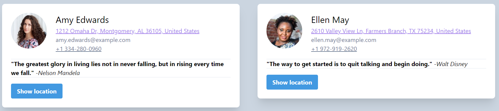
 
The address card component has the following capabilities:

- Specify name, address, email, phonenumber - all fields except name are optional
  
- If a geo-location (latitude, longitude) is specified, a "show location" button is shown that flips the card and show the location on a map

- If the "address is link" option is specified, the address becomes a link that opens the location in Google Maps

- If the "phonenumber is link" option is specified, the phonenumber becomes a link that tries to dial from your device

- The address card has an area for additional content, in the above case to show the favorite quote of the card holder
 
When the "show location" button is pressed, the card flips to show the map:

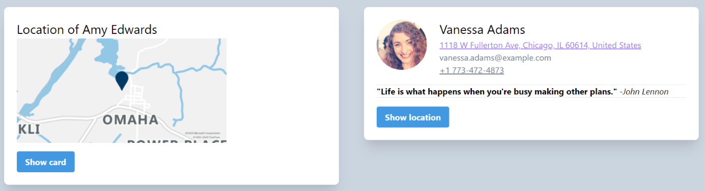

## Attributes or slots - SEO
I wrote two versions of the address card, one with all data in attributes as you would do in a ReactJS component, and one where data can be injected through slots.

Using the address card web component with attributes looks like:

```html
<dmp-addresscard 
  imgsrc="images/Amy Edwards.jpg" 
  name="Amy Edwards"
  address="1212 Omaha Dr, Montgomery, AL 36105, United States" 
  lat="32.1479602" lon="-85.0162703"
  email="amy.edwards@example.com" phonenumber="+1 334-280-0960"  
  phonenumberislink="true" 
  addressislink="true">
	<hr class="mt-4" />
	<strong>"The greatest glory in living lies not in never falling, 
            but in rising every time we fall."</strong>
	<em>-Nelson Mandela</em>
	<hr/>
</dmp-addresscard>
```

Using the address web component with slots looks like:

```html
<dmp-slottedaddresscard 
  phonenumberislink="true" 
  addressislink="true" 
  lat="32.1479602" lon="-85.0162703">
	<div slot="image"></div>
	<div slot="name">Amy Edwards</div>
	<div slot="address">1212 Omaha Dr, Montgomery, AL 36105, United States</div>
	<div slot="phonenumber">+1 334-280-0960</div>
	<div slot="email">amy.edwards@example.com</div>
	<div slot="block">
	  <hr class="mt-4" />
	  <strong>"The greatest glory in living lies not in never falling, 
              but in rising every time we fall."</strong>
	  <em>-Nelson Mandela</em>
	  <hr />
	</div>
</dmp-slottedaddresscard>
```

I added those components to a set of pages that can be found at https://mango-river-020e4d803.azurestaticapps.net/ so they can be indexed by search engines. The most important pages are:

- [index-attributes.html](https://mango-river-020e4d803.azurestaticapps.net/index-attributes.html) - featuring Amy Edwards and Vanessa Adams
- [index-slotted.html](https://mango-river-020e4d803.azurestaticapps.net/index-slotted.html) - featuring Amy Edwards and Ellen May
  
When I search for `Amy Edwards site:mango-river-020e4d803.azurestaticapps.net` I get:
 
 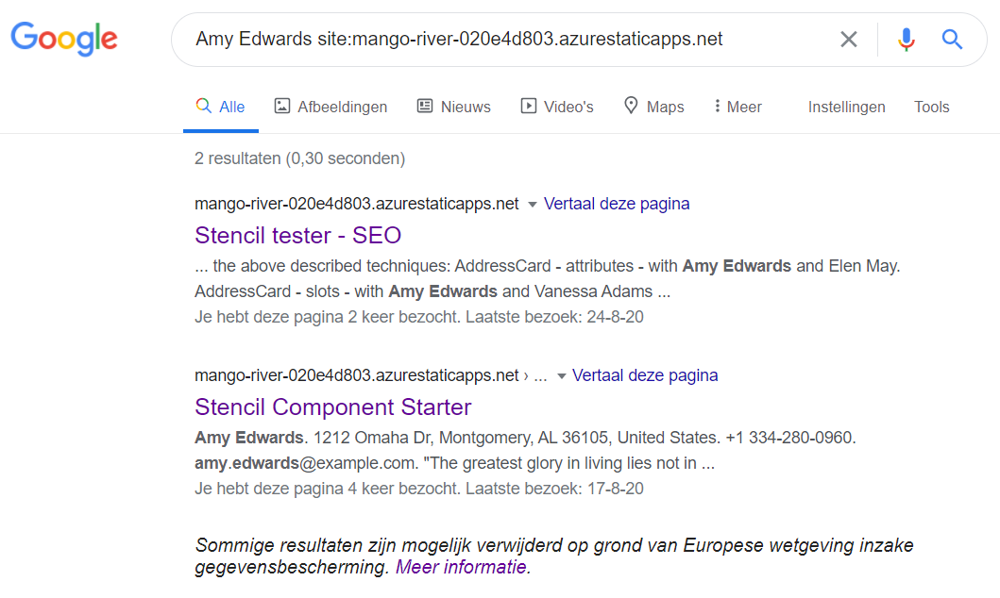

In the above results the first hit is the main page just mentioning **Amy Edwards**, the second hit is the `index-slotted.html` page. The `index-attributed.html` page where the name **Amy Edwards** is specified in attributes does not come back in the search result. Same happens when we search for **Vanessa Adams** which is specified in attributes, the `index-attributed.html` page in NOT returned in the search results.

A similar SEO check was done in the Medium post [Web Components and SEO](https://medium.com/patternfly-elements/web-components-and-seo-58227413e072), with the same conclusion that it is mot possible to use attributes for SEO relevant content.

In the documentation on Google Search in the section [Follow best practices for web components](https://developers.google.com/search/docs/guides/javascript-seo-basics#use-meaningful-http-status-codes) it is stated that:

>Googlebot supports web components. When Googlebot renders a page, it [flattens the shadow DOM and light DOM](https://developers.google.com/web/fundamentals/web-components/shadowdom#lightdom) content. This means Googlebot can only see content that's visible in the rendered HTML. To make sure that Googlebot can still see your content after it's rendered, use the [Mobile-Friendly Test](https://g.co/mobilefriendly) or the [URL Inspection Tool](https://support.google.com/webmasters/answer/9012289) and look at the rendered HTML.
>
>If the content isn't visible in the rendered HTML, Googlebot won't be able to index it.

## Using web components in Sitecore SXA
In my weblog post [Creating Sitecore SXA 9.3+ renderings without C#](https://www.sergevandenoever.nl/Sitecore-93-SXA-custom-rendering/) I described how to create an Address Card rendering in Sitecore SXA using a datasource and parameters. I used a Scriban template for the `Plain` rendering variant which writes out the content without any styling or interactivity.

The next step is to use our [`dmp-slottedaddresscard`](https://github.com/svdoever/sxa-umbrella-webcomponents/blob/master/src/components/dmp-slottedaddresscard/dmp-slottedaddresscard.tsx) web component within the Scriban template. The code for this web component can be found in the GitHub repository https://github.com/svdoever/sxa-umbrella-webcomponents. Building the web components in this repository results in a set of front-end artifacts that looks like:


There are some interesting observations to make about the above artifacts:

1. There are tree entry-point bundles to be referenced from the web page: `sxa-umbrella-webcomponents.css` for the styles, `sxa-umbrella-webcomponents.esm.js` as the JavaScript bundle for modern browsers, `sxa-umbrella-webcomponents.js` as the JavaScript bundle for Internet Explorer 11.
   
2. The `sxa-umbrella-webcomponents.js` for Internet Explorer 11 is large (120 KB), this is because this bundle contains the polyfill to support web components on Internet Explorer 11.
   
3. There is no support for browsers lower than Internet Explorer 11 (actually I would prefer not to support Internet Explorer 11 at all!)

4. The bundle `sxa-umbrella-webcomponents.esm.js` for modern browsers is really small (520 bytes) and knows how to dynamically load additional bundles (all the small JavaScript artifact files) when web components are used on the web page.

It would be nice to make these artifacts part of a Sitecore SXA theme, but the problem is that we can't change the filenames (auto-generated), and we can't upload these files into the Sitecore Media Library as described in my LinkedIn post [Why Sitecore sucks for hosting your front-end artifacts](https://www.linkedin.com/pulse/why-sitecore-sucks-hosting-your-front-end-artifacts-van-den-oever/).

We could create an additional folder `assets/sxa-umbrella-webcomponents` in the Sitecore web site to host these files which works perfectly well, but this means that we need to deploy these file to every CM and CD which is suboptimal for scaling, and it will not work in a future SAAS version of Sitecore.

Another option would be to publish the files on any website or CDN, and reference the files from there. I chose a different option for the production deploy, but with the same result: I published the artifacts as an NPM package with a version, and reference them through https://unpkg.com/. This allows referencing every version of the published artifacts which are served through a Cloudflare CDN.

During development We could create an IIS virtual directory at `assets/sxa-umbrella-webcomponents` pointing to the `dist/sxa-umbrella-webcomponents` folder so the sxa-umbrella-webcomponents build results in watch mode would become available immediately within Sitecore.
 
To reference the required files I added a HTML Snippet to the Metadata partial design from the Sitecore Experience Accelerator:

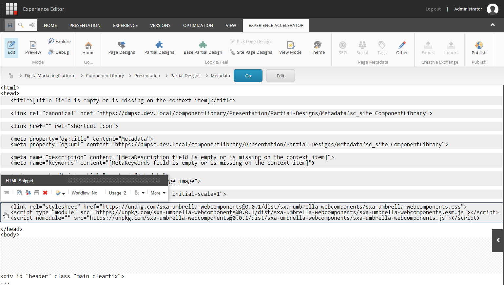
 
For copy/paste purposes the relevant lines of the HTML snippet:

```html
<link rel="stylesheet" href="https://unpkg.com/sxa-umbrella-webcomponents@0.0.1/dist/sxa-umbrella-webcomponents/sxa-umbrella-webcomponents.css" />
<script type="module" src="https://unpkg.com/sxa-umbrella-webcomponents@0.0.1/dist/sxa-umbrella-webcomponents/sxa-umbrella-webcomponents.esm.js">
</script>
<script nomodule src="https://unpkg.com/sxa-umbrella-webcomponents@0.0.1/dist/sxa-umbrella-webcomponents/sxa-umbrella-webcomponents.js">
</script>
```

I'm still looking for a solution to make the base path configurable between development and production as described in [this question on StackOverflow](https://stackoverflow.com/questions/63629474/how-to-use-use-tokens-in-sitecore-sxa-metadata-partial-design).

We load the JavaScript modules with differential module loading using the [module-nomodule](https://css-tricks.com/differential-serving/) trick to load the correct bundle.

We can now use the [`dmp-slottedaddresscard`](https://github.com/svdoever/sxa-umbrella-webcomponents/blob/master/src/components/dmp-slottedaddresscard/dmp-slottedaddresscard.tsx) web component within the Scriban template, so I created an additional rendering variant for the **Address Card** rendering called `WC Slots` with a Scriban item and the following Scriban template:

```
{{
if !o_pagemgde.is_experience_editor_editing && (sc_parameter 'PhonenumberIsLink')
  phonenumberIsLink = "true"
else
  phonenumberIsLink = "false"
end
}}


{{
if !o_pagemode.is_experience_editor_editing && (sc_parameter 'AddressIsLink')
  addressIsLink = "true"
else
  addressIsLink = "false"
end
}}


<dmp-slottedaddresscard 
  phonenumberislink={{phonenumberIsLink}} 
  addressislink={{addressIsLink}} 
  lat="{{i_item.Latitude.raw}}" lon="{{i_item.Longitude.raw}}">
  <div slot="image">{{i_item.Image}}</div>
  <div slot="name">{{i_item.Name}}</div>
  <div slot="address">{{i_item.Address}}</div>
  <div slot="phonenumber">{{i_item.Phonenumber}}</div>
  <div slot="email">{{i_item.Email}}</div>
  <div slot="block">
   {{sc_placeholder "dynAcSlot"}}
  </div>
</dmp-slottedaddresscard>
```

Selecting the `WC Slots` rendering variant for the **Address Card** rendering results in:

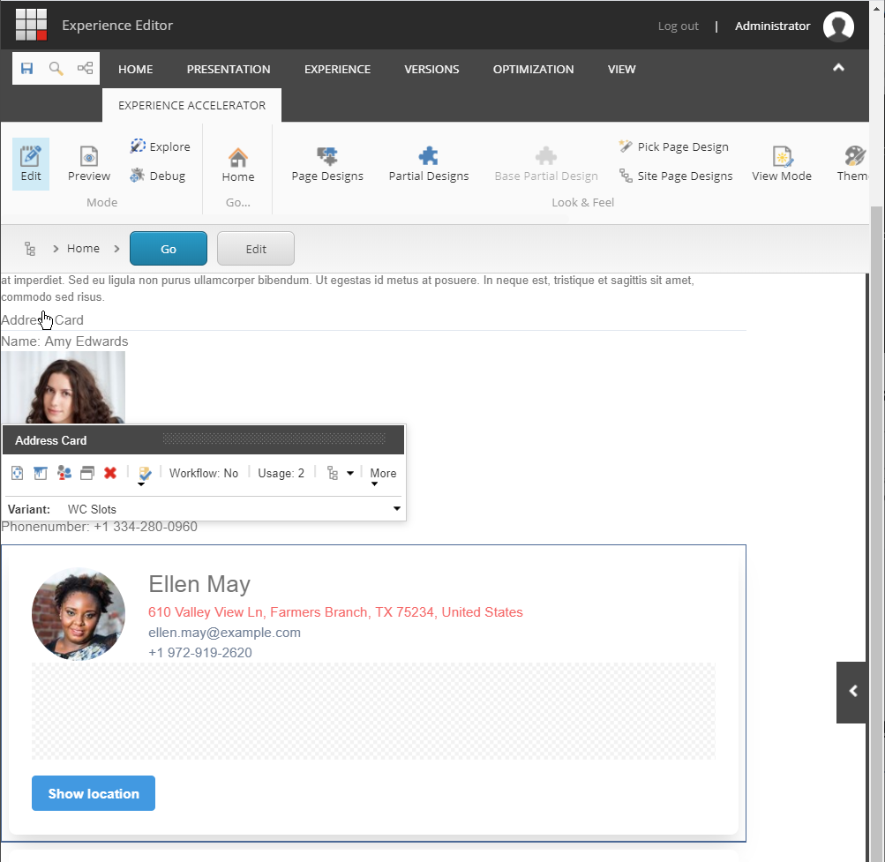

The `WC Slots` **Address Card** rendering variant contains a dynamic placeholder where I can place a `Page Content / Rich Text` rendering to render the rich text of quotes as an example:

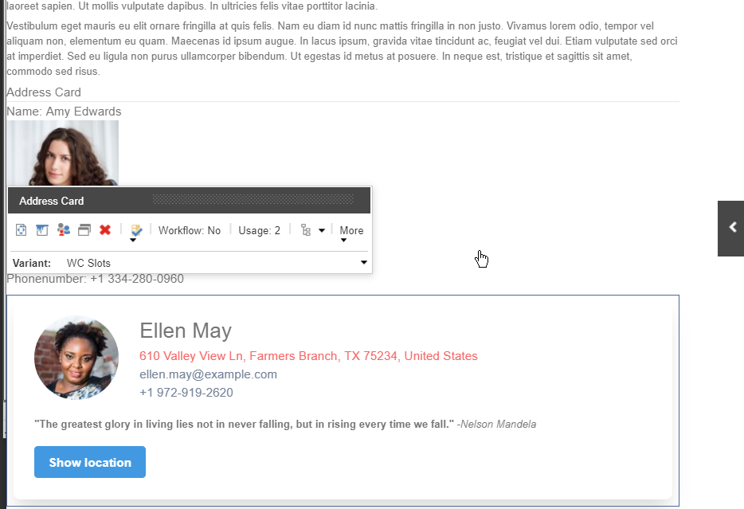

But it is possible to place any standard SXA rendering in the dynamic placeholder. For example a `Composites / Carousel` like in the image below:

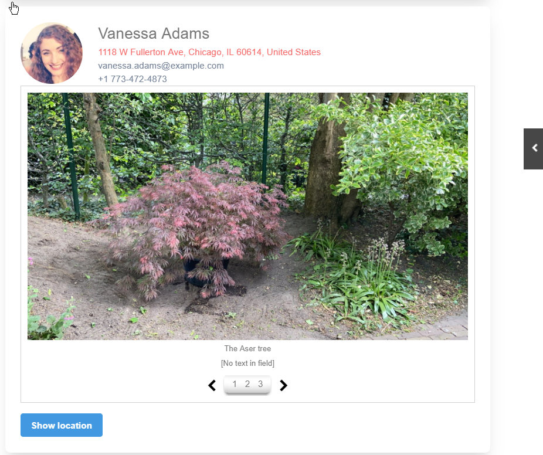

 
In the Experience Editor it is also possible to edit the texts on the Address Card directly:
 
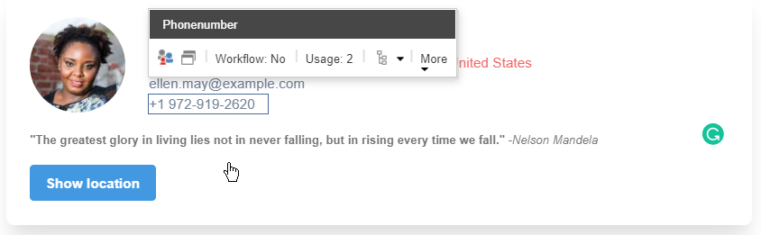
 
## Next steps
Because web components provide additional custom HTML elements that can be used just like any standard HTML element, these elements can be rendered server-side through Scriban, Razor pages (CSHTML) or PHP if you like. They can also be used from any front-end framework like ReactJS, Vue or Angular. This makes them the ultimate building blocks for your design system of components to be used over multiple channels as described in the blog post [5 Reasons Web Components Are Perfect for Design Systems](https://blog.ionicframework.com/5-reasons-web-components-are-perfect-for-design-systems/). In my example at https://mango-river-020e4d803.azurestaticapps.net/ I showcase the use of the **Address Card** component from [ReactJS](https://mango-river-020e4d803.azurestaticapps.net/react) and [Vue](https://mango-river-020e4d803.azurestaticapps.net/vue) as well, and I show how [Storybook](https://mango-river-020e4d803.azurestaticapps.net/storybook) can be used to document and showcase components.

Address card components used from ReactJS:
 
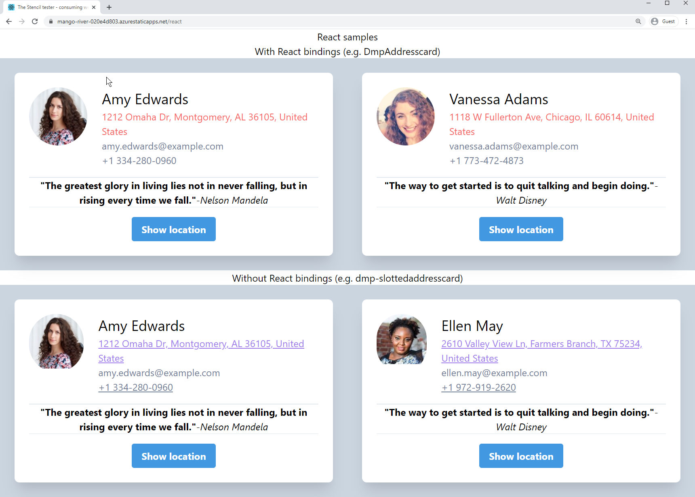
 
Address card components used from Vue:
 


Address card in Storybook:

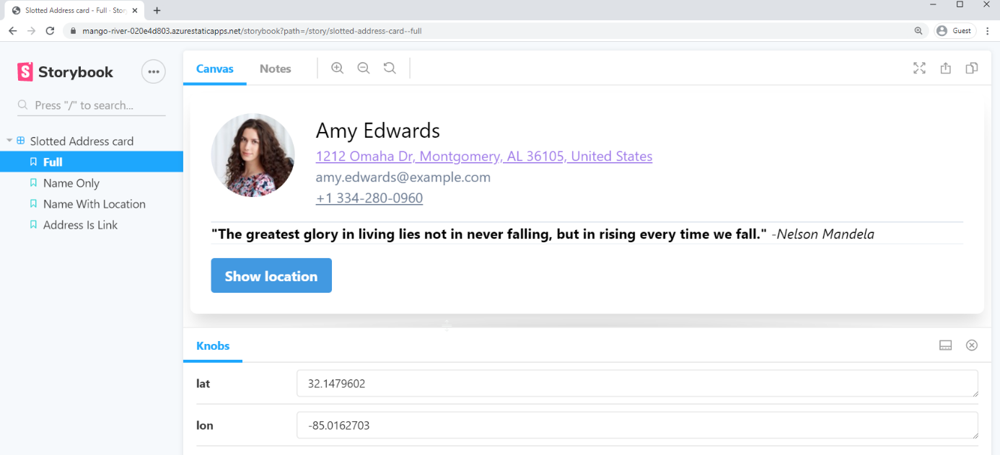

Given the above capabilities, a nice overview of what we could achieve by adopting web components is given in the picture below:

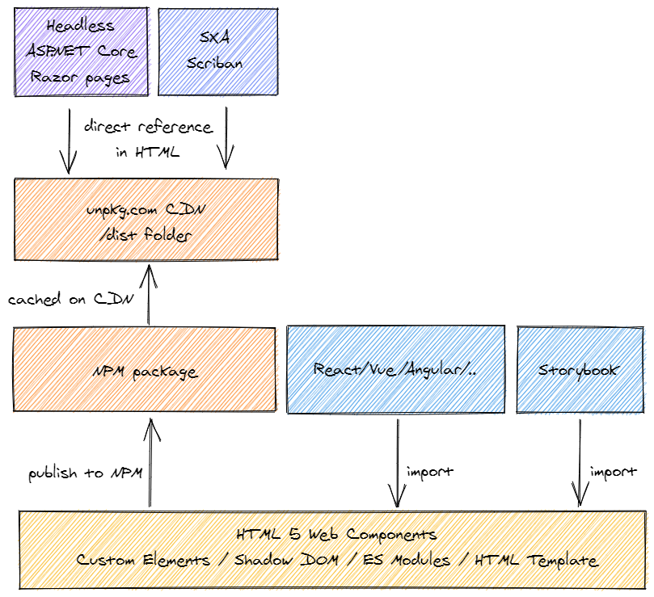
 
## Conclusion
In this blog post and the provided links I show how web components are a great candidate for building Sitecore SXA rendering variants that seamlessly integrate with existing Sitecore renderings and provide great SEO. The described approach could be the start of a design system with components that can be applied across your web applications from different web frameworks. So in my opinion web components are the silver bullet for Sitecore SXA... and beyond!

### Links
https://mango-river-020e4d803.azurestaticapps.net/ - web components sample + ReactJS + Vue + Storybook

https://github.com/svdoever/sxa-umbrella-webcomponents - GitHub repo of the above web site

### Weblog posts
[Creating Sitecore SXA 9.3+ renderings without C#](https://www.sergevandenoever.nl/Sitecore-93-SXA-custom-rendering/)

[Why Sitecore sucks for hosting your front-end artifacts](https://www.linkedin.com/pulse/why-sitecore-sucks-hosting-your-front-end-artifacts-van-den-oever/)


