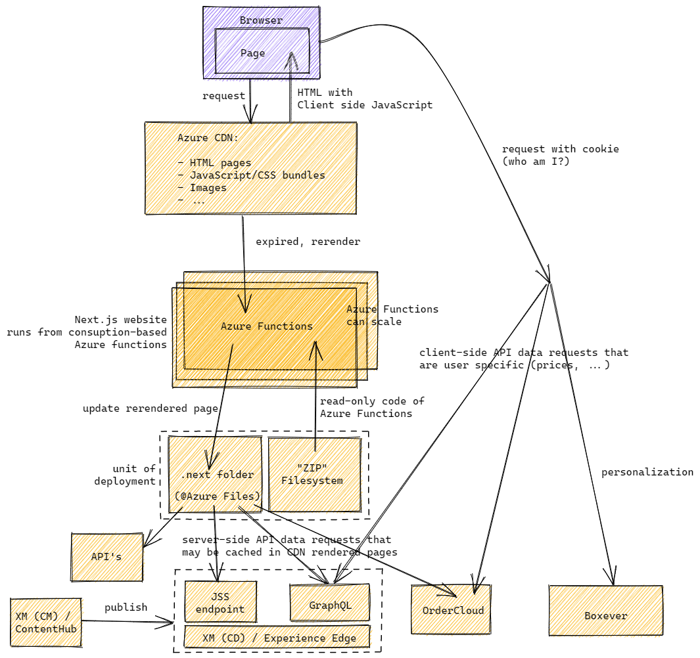

With the Next.js on Azure solution as can be found in the open-source GitHub repository https://github.com/macaw-cad/nextjs-on-azure, we see the implementation of a Next.js solution connected to Sitecore JSS and all the future goodness as follows:

Core web trafic is handled by Azure CDN, which supports the required expiration headers for Next.js. When Incremental Static Regeneration (ISG) is needed for a specific page, this is handled by a consumption-based Azure function. Assets like images are currently streamed through Azure functions as well, and are cached in the Azure CDN. When Experience Edge is used, the CDN of Experience Edge will fullfill this function for assets.

For more information see my blog post [Next.js on Azure, and an example on how to use it for Sitecore JSS](https://www.sergevandenoever.nl/nextjs-on-azure-and-sitecore).