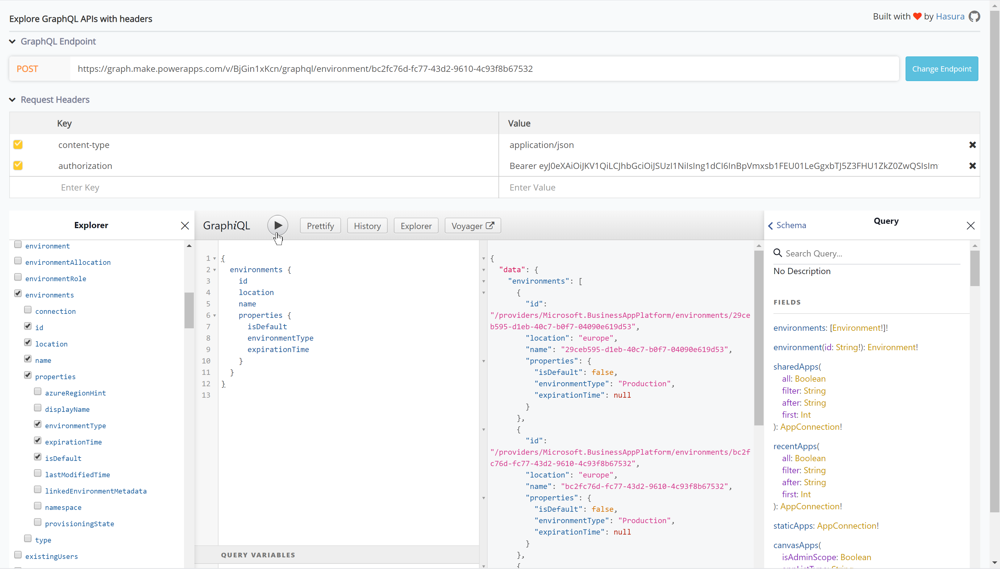
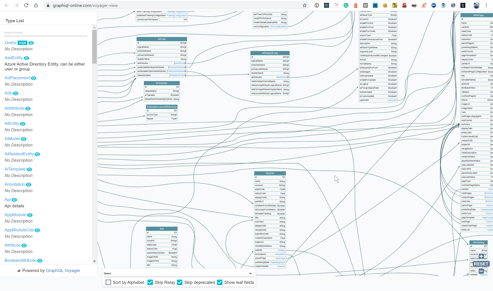

PowerApps Portals is positioned as a low-code platform. Built on top of the Dynamics and the underlying Common Data Services (CDS) it enables the "citizen" developer to create public facing websites with support for logged-in users. Underlying the WYSIWYG editing GraphQL is used to do updates on the content and configuration of the portal.

For an introduction on PowerApps Portals have a look at the following links:

- [Introducing PowerApps Portals: powerful low-code websites for external users](https://powerapps.microsoft.com/en-us/blog/introducing-powerapps-portals-powerful-low-code-websites-for-external-users/)
- [What is Power Apps portals?](https://docs.microsoft.com/en-us/powerapps/maker/portals/overview)

Ok, lets get started! When you login to https://make.powerapps.com you can create your own portal:


When you create a portal, two apps are created:


1. The Portal with the name also used in the public url of your portal, e.g. https://svdoever.powerappsportals.com
2. A Portal Management model-driven app for the management of your portal

When you select **Edit** on the portal app you get into the edit experience of the portal:


If you do for example save a css file have a look at the network tab of the Chrome developers tools:


The first two calls showing only the environment id are interesting. The first call is the CORS preflight request and the second call is the actual POST request to save the css file. If we inspect the url of the request it is something like:

```https://graph.make.powerapps.com/v/BjGin1xKcn/Graphql/environment/bc2fc76d-fc77-43d2-9610-4c93f8b67532```

As you can see there is **Graphql** in the name!

If we inspect the POST body we see the following content:

```json
[
    {
        "operationName":"UpdateAnnotation",
        "variables":{
            "id":"586ee8dc-b638-ea11-a813-000d3ab701f8",
            "inputEntity":{
                "documentBody":"...",
                "mimeType":"text/css"
            }
        },
        "query":"mutation UpdateAnnotation($id: String!, $inputEntity: InputAnnotation!) {\n  updateAnnotation(id: $id, inputEntity: $inputEntity) {\n    ...AnnotationFields\n    __typename\n  }\n}\n\nfragment AnnotationFields on Annotation {\n  id\n  mimeType\n  documentBody\n  fileName\n  objectTypeCode\n  __typename\n}\n"
    }
]
```
Note: the **documentBody** is the Base64 encoded content of the css file, and is replaced with "..." in the above query.

What we see here is a GraphQL mutation query with parameters for the query. So as you can see a GraphQL API layer is provided as part of PowerApp Portals!

Other interesting things to notice:
- The GraphQL endpoint is available in the source of the page, together with other information:
  ```json
  window._makerConfig = {
      "aadClientId":"a8f7a65c-f5ba-4859-b2d6-df772c264e9d",
      "location":"WEU",
      "region":"prod",
      "publicPath":"https://content.powerapps.com/resource/makerx/",
      "alternativePublicPath":"https://pa-static.azureedge.net/resource/makerx/",
      "graphQLEndpoint":"https://graph.make.powerapps.com/v/RWeo750_up/",
      "portalVersionedEndpoint":"https://make.powerapps.com/v/0.0.20200116.2-t1912.2-prod.prod.8092523c.RWeo750_up/"
  }
- The headers of the request contains an **Authorization** header with the Bearer token to get authorization for the GraphQL requests.

The third and fourth marked calls are the `invalidate-cache-maker` calls, where the third call is again a CORS preflight request and the fourth call is the POST request to invalidate the cache for changed elements in the CDS.
If we inspect the url of the request it is something like:

```
https://svdoever.powerappsportals.com/_services/portal/9ce03968-f8d8-4ae6-9e66-aaccf63bd684/invalidate-cache-maker
```

where `9ce03968-f8d8-4ae6-9e66-aaccf63bd684` is the id of the portal as we can find in the source code of our portal:

```
<script type="text/javascript">
    window["Microsoft"] = window["Microsoft"] || {};
    window["Microsoft"].Dynamic365 = {
        Portal: {
            User: {
                contactId: '',
                userName: ''
            },
            version : '9.1.9.84',
            type: 'CDSStarterPortal',
            id: '9ce03968-f8d8-4ae6-9e66-aaccf63bd684'
        }
    }
</script>
```

If we inspect the POST body of the request we see the following content:

```json
{
    "runtimeInvalidationRequest":"{\"entities\":[{\"entityName\":\"annotation\",\"entityId\":\"586ee8dc-b638-ea11-a813-000d3ab701f8\"}]}"
}
```

It specifies one (or more) entity ids of type **annotation** that should be invalidated.

It should be noted that the used Bearer token in the authorization header is different.

To easily get access to your JWT tokens (Bearer tokens) install the tool [JWT Analyzer & Inspector](https://chrome.google.com/webstore/detail/jwt-analyzer-inspector/henclmbnehmcpbjgipaajbggekefngob).

Using this tool we can inspect the different tokens available:


The first token with the Guid is the required **Bearer** token for the GraphQL queries. When you press this entry a JWT token is shown that can be easily copied.
The second token named `<organization>.crm4.dynamics.com` in the Bearer token for the invalidation requests.

The cool thing of GraphQL that you can run introspection queries to learn about the available fields and types of a GraphQL schema. That introspection capability is also what gives GraphiQL the ability to provide documentation about the schema and autocompletion.

Luckily enough there is a great hosted version of the GraphiQL tooling available at https://graphiql-online.com/. If you open this url you are asked for the GraphQL endpoint, e.g. `https://graph.make.powerapps.com/v/BjGin1xKcn/graphql/environment/bc2fc76d-fc77-43d2-9610-4c93f8b67532` and we can add a request header **authorization** containing the value **Bearer ....** where ... is the value of the JWT token needed for the GraphQL queries.

This online GraphiQL tool provides us also with an **Explorer** to easily create GraphQL queries, and all the documentation on the available queries:



The **Voyager** tooling allows us to see a GraphQL API as an interactive graph. 


Note that the JWT tokens expire, and if this happens that a fresh copy of the JWT token must be provided to the GraphiQL tooling.

In a next blog post I will describe how we can build a great professional front-end development experience on top of the GraphQL API and the cache invalidation API where we use:

- SASS that is transpiled into CSS and uploaded to the portal
- TypeScript that is transpiled into JavaScript and uploaded to the portal
- Source control to manage the front-end artifacts

With this approach a professional front-end developer can build the required building blocks to support "citizen" developers. In this way we can work together as a team on developing a PowerApps Portal.