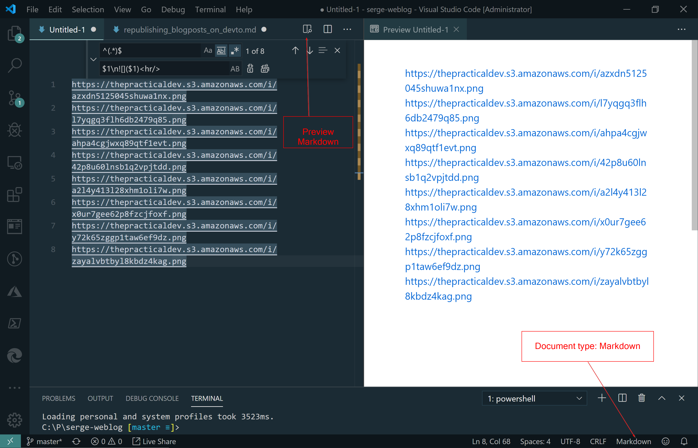
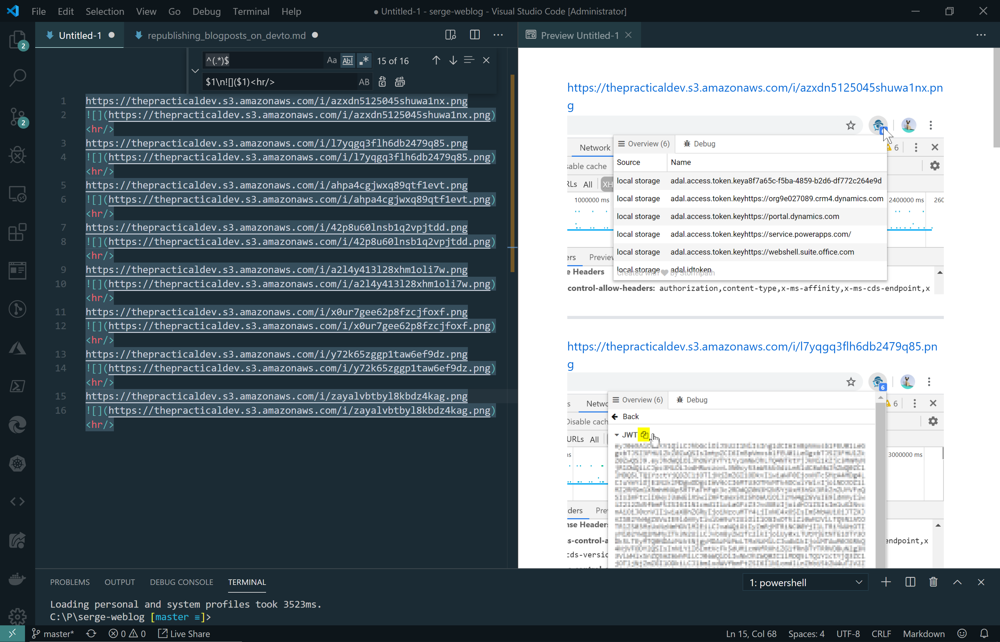

I had my weblog for years at https://weblogs.asp.net/soever, and then decided to move over to Medium at https://medium.com/@svdoever. Like many bloggers I was not happy with [the way Medium treats it's readers](https://medium.com/@nikitonsky/medium-is-a-poor-choice-for-blogging-bb0048d19133).
I decided to move over to my own Markdown blogging platform on https://www.sergevandenoever.nl, and it works great! I use a Gatsby based system of static site generation: commit changes to [my Github based repository](https://github.com/svdoever/svdoever.github.io) and stuff gets published.

The only problem is that I have almost no readers. I put a lot of work in research and writing my blog posts, so have the hope that more people could be interested in them. I came across the post [The Results of Four Weeks of Cross-Posting to Dev.To](https://dev.to/claudiobernasconi/the-results-of-four-weeks-of-cross-posting-to-dev-to-3d8b) so I decide to give it a try.

Here are the steps I take for cross-posting from a Markdown blog to https://dev.to:

1. Create a new post on https://dev.to by pressing the **WRITE A POST** and copy over the Markdown
2. Upload all images linked into your blog to https://dev.to by clicking the image button  and click **Choose Files** under Body Images. Select all your images of your original blog post at once. You are then provided a text area with all **Direct URLs**. https://dev.to rewrites the names of your images, so it is difficult to correlate the new urls to your original images.
3. Copy this list of image urls into a new file in Visual Studio Code, and set the format of the file to Markdown in the bottom-right of Visual Studio Code. Now press the Markdown preview button.

4. Press Ctrl-H to do replacements on the file and select the right option for regular expressions. In the top field type `^(.*)$` and in the bottom field type `$1\n
`. Now select replace all ocurrences. This will result in the following:

5. Put your original post next to the post in the https://dev.to edit window and replace all old image urls to the new image urls created by https://dev.to as can be seen in the Markdown preview in Visual Studio code where you have the new url with the corresponding image.
6. Press the "..." button and set the **Canonical URL** to the url of your original blog post, and add a series name if relevant.
7. If your post is correct in the preview press publish!

It would be great if https://dev.to would provide and api to automate the above tasks but this approach works good enough to get your cross-posting done!