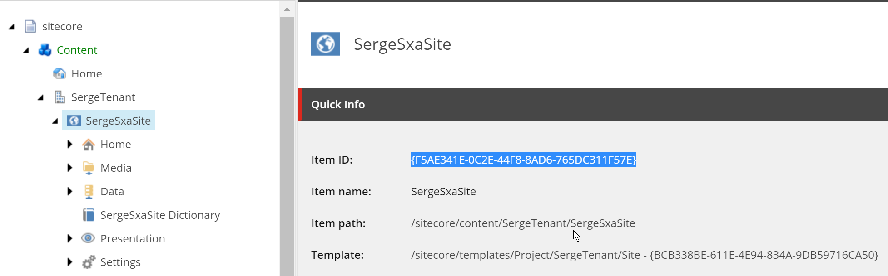
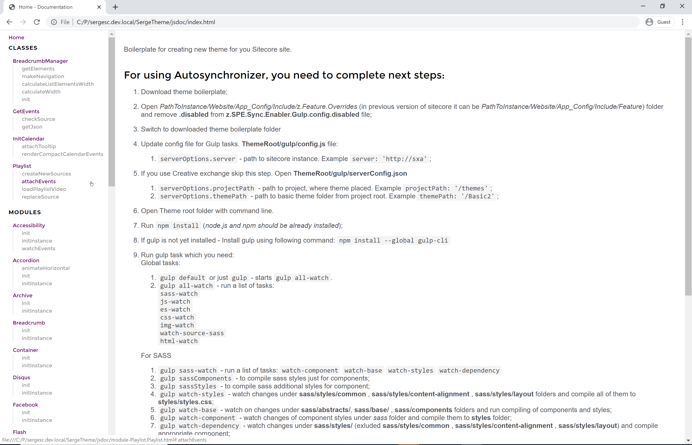

# Why Sitecore 9.3 SXA CLI?

There are some good reasons why to use SXA CLI for your Sitecore SXA development:

- Front-end developers get bored by clicking through Sitecore to create HTML structures for the rendering variants
- Importing/exporting front-end assets through Creative Exchange sounds like a very brittle and uncontrollable process 
- Real developers use version control for your theme files
- We don't want to get the  Media Library polluted with unnecessary files
- We only want transpiled and minified assets stored in Sitecore

# Getting SXA CLI installed

## Introduction
After some puzzling I got the SXA CLI working on Windows 10. After I wrote the installation description below I also found a blog post by [Mark van Aalst](https://www.markvanaalst.com/) called [Installing the SXA CLI](https://www.markvanaalst.com/blog/sxa/installing-the-sitecore-sxa-cli/). He knows infinitely more about Sitecore than I do, so check out his blog post as well, but you may find some additional interesting information in this blog post as well. Check out his video [SXA Front-End Developer Workflow - Creating a theme using SXA CLI](https://www.youtube.com/watch?v=MDWuqhmvwgI) as well to get a good overview of the installation process.

## Getting the correct version of NodeJS installed

The first requirement for the SXA CLI is NodeJS version 11.15.0 (the latest 11 version) or lower because an error occurs when using the 12+ version of NodeJS.

What I did was install the [Node Version Switcher](https://github.com/jasongin/nvs), because I want to keep working with newer versions of NodeJS on other projects.

When the Node Version Switcher is installed as described on the GitHub page, execute `nvs 11.15.0` to switch to the correct NodeJS version.

When using SXA CLI with a NodeJS version higher than 11.15.0 the following error will occur when running `npm run gulp`:

```
[11:26:45] Requiring external module @babel/register
fs.js:34
} = primordials;
    ^

ReferenceError: primordials is not defined
```

## The actual installation of SXA CLI

The next step is to install the SXA CLI as described in the [documentation](https://doc.sitecore.com/developers/sxa/93/sitecore-experience-accelerator/en/add-a-theme-using-sxa-cli.html).

As a first step remove the `.disabled` extension of the file `C:\inetpub\wwwroot\sergesc.dev.local\App_Config\Include\z.Feature.Overrides\z.SPE.Sync.Enabler.Gulp.config.disabled` (your path may vary). This enables the [Creative Exchange Live](https://doc.sitecore.com/developers/sxa/93/sitecore-experience-accelerator/en/modify-your-site-design-with-creative-exchange-live.html) feature of Sitecore SXA.

Execute the following steps (I'm using the site name https://sergesc.dev.local/, yours will hopefully be different):

```
npm config set @sxa:registry https://sitecore.myget.org/F/sc-npm-packages/npm/
npm i -g @sxa/CLI
sxa register https://sergesc.dev.local/
```

Note that if you run the above commands from a PowerShell console, the **@** character must be escaped using the backtick (\`) like so:
```
npm config set `@sxa:registry https://sitecore.myget.org/F/sc-npm-packages/npm/
```

Create a folder for your project in a folder that normally holds your projects, and in this folder execute the command `sxa new YourThemeName` and answer the questions:

```
mkdir sergesc.dev.local
cd sergesc.dev.local
sxa new SergeTheme
? The theme will be created for instance based on url https://sergesc.dev.local/. Do you want to specify a different url? no
? Enter your login admin
? Enter your password [hidden]
? Specify theme path. Root is Themes folder(format <RootFolderName/ChildFolderName>) SergeTenant/SergeSxaSite
? Do you want to set up theme config file? yes
? Choose active modules for your theme (Press <space> to select, <a> to toggle all, <i> to invert selection)SearchSiteSetup, MapsSiteSetup, ThemingSiteSetup
Theme downloading....
  √ Create theme folder
  √ copy project files
? Do you want to set up url to Sitecore instance?(Current is:https://sergesc.dev.local/) yes
? Specify Sitecore instance url https://sergesc.dev.local/
? [JS]Do you want to transpile ES6+ javascript files down to ES2015 (babel used) yes
? [JS]Do you want to compile minified file (pre-optimized-min.js) yes
? [JS]Do you want to upload js source files (If false - only optimized file will be uploaded) no
? [CSS]Do you want to compile minified file (pre-optimized-min.css) yes
? [CSS]Do you want to upload css source files (If false - only optimized file will be uploaded) no
? [SASS]Do you want to upload sass source files (If false - only optimized css file will be uploaded) no
Done
DONE Project ready
```

Note that you can run `sxa init` when you want to answer the above questions again to change something in the configuration, or you can manually modify the resulting files `gulp\config.js` and `gulp\serverConfig.json`. Be careful to rerun `sxa init` when you did manual modifications to these files! 

Move into the created directory and do an `npm install`:
```
cd SergeTheme
npm install
```

# Running the SXA CLI

The `package.json` contains two scripts: `doc` and `gulp`:
```
  "scripts": {
    "doc": "rimraf ./jsdoc/ | jsdoc -c ./node_modules/@sxa/celt/jsdoc.json",
    "gulp": "./node_modules/gulp/bin/gulp.js"
  },
```

When executing the command `npm run gulp` the following error occurs:
```
npm run gulp

> @sxa/Theme@1.0.1 gulp C:\P\sergesc.dev.local\SergeTheme
> ./node_modules/gulp/bin/gulp.js

'.' is not recognized as an internal or external command, operable program or batch file.
```

This error is easy to fix, add `node` in front of the gulp.js path and it works:
```
    "gulp": "node ./node_modules/gulp/bin/gulp.js"
```

You will see the following output:
```
> @sxa/Theme@1.0.1 gulp C:\P\sergesc.dev.local\SergeTheme
> node ./node_modules/gulp/bin/gulp.js

[22:20:24] Requiring external module @babel/register
[22:20:27] Using gulpfile C:\P\sergesc.dev.local\SergeTheme\gulpfile.babel.js
[22:20:27] Starting 'login'...
? Enter your login admin
? Enter your password [hidden]
[22:20:33] Finished 'login' after 5.75 s
[22:20:33] Starting 'all-watch'...
gulp.run() has been deprecated. Use task dependencies or gulp.watch task triggering instead.
[22:20:33] Starting 'sass-watch'...
[22:20:33] Starting 'watch-component'...
[22:20:33] Starting 'watch-base'...
[22:20:33] Starting 'watch-styles'...
[22:20:33] Starting 'watch-dependency'...
[22:20:33] Finished 'sass-watch' after 31 ms
[22:20:33] Starting 'login'...
[22:20:33] Finished 'all-watch' after 43 ms
[22:20:33] Starting 'default'...
[22:20:33] Finished 'default' after 35 μs
[22:20:33] Finished 'login' after 20 ms
[22:20:33] Starting 'html-watch'...
[22:20:33] Starting 'login'...
[22:20:33] Finished 'html-watch' after 15 ms
[22:20:33] Finished 'login' after 1.48 ms
[22:20:33] Starting 'watch-html'...
[22:20:33] Starting 'watch-source-sass'...
[22:20:33] Starting 'img-watch'...
[22:20:33] Starting 'login'...
[22:20:33] Finished 'img-watch' after 1.29 ms
[22:20:33] Finished 'login' after 1.06 ms
[22:20:33] Starting 'watch-img'...
[22:20:33] Starting 'css-watch'...
[22:20:33] Starting 'login'...
[22:20:33] Finished 'css-watch' after 11 ms
[22:20:33] Finished 'login' after 1.43 ms
[22:20:33] Starting 'watch-css'...
[22:20:33] Starting 'es-watch'...
[22:20:33] Starting 'login'...
[22:20:33] Finished 'es-watch' after 13 ms
[22:20:33] Finished 'login' after 911 μs
[22:20:33] Starting 'watch-es'...
[22:20:33] Starting 'js-watch'...
[22:20:33] Starting 'login'...
[22:20:33] Finished 'js-watch' after 2.19 ms
[22:20:33] Finished 'login' after 2.97 ms
[22:20:33] Starting 'watch-js'...
Watching SASS files started...
Watching HTML files started...
Watching Image files started...
Watching CSS files started...
Watching ES files started...
Watching JS files started...
```

The gulp script does a login, and all changes are compiled, optimized and uploaded to Sitecore.

Note that the file `SergeTheme\gulp\config.js` contains all configurations for the generic gulp tasks living in the npm package `@sxa/celt`. The name `celt` stands for `Creative Exchange Live for SXA themes`. It is a pity that Sitecore did not open-source the package (yet) as they did with [Sitecore JavaScript Services](https://github.com/Sitecore/jss).

# Assigning the new theme

To assign the new theme to your site:

1. In the Content Editor select the `Settings` item: `sitecore/Content/SergeTenant/SergeSxaSite/Settings`
2. In the `Site Configuration` section go to the `Compatible themes` and select the theme `Media Library/Themes/SergeTenant/SergeSxaSite/SergeTheme`
3. Right-Click on the item `sitecore/Content/SergeTenant/SergeSxaSite/Home` and select `Experience Editor`
4. In the Experience Editor select EXPERIENCE ACCELERATOR in the top bar
5. Click on Theme and select your new SergeTheme for Default

# See it in action

To see that it is really working, open the file `SergeTheme\sass\main.scss` and add `background-color: red;` to the body styling:

```
body {
    :
    background-color: red;
}
```

In the experience editor, the background will change to red.

Now open an anonymous browser window (otherwise cookies will throw you in the editor again) and navigate to https://sergesc.dev.local/SergeSxaSite, and note that the site without a red background will be visible.

To publish changes made to the theme:

1. Open the Content Editor and select the theme folder `Media Library/Themes/SergeTenant/SergeSxaSite/SergeTheme` 
2. Select **PUBLISH** in the top bar
3. Select **Publish - Publish site**
4. Select **Incremental publish** and click the **Publish** button

Now navigate again to the anonymous browser window with your page https://sergesc.dev.local/SergeSxaSite in it, and press the browser refresh button. Nothing happens, because a cached version of the CSS is used. Press F12 to open the developer tools, now right-click on the browser refresh button (assuming you are using Chrome) and select **Empty Cache and Hard Reload**.

# Automating the theme publishing

_Update: some nice automation stuff below, but a colleague of mine pointed out to me that it is also possible to configure automatic published to **web** for preview because going to the Sitecore UI all the time to publish the theme items is rather annoying. See the documentation [Publishing items to a preview publishing target](https://doc.sitecore.com/users/93/sitecore-experience-platform/en/publishing-items-to-a-preview-publishing-target.html) for more information._

Of course, it can be automated... enter the [Sitecore PowerShell Extensions](https://doc.sitecorepowershell.com/):

_The SPE Remoting module provides remote connectivity to a Sitecore instance. The Sitecore PowerShell Extensions (SPE) module must be installed and configured to accept remoting connections._

## Enable PowerShell remoting

To enable PowerShell remoting in the correct way follow the guidance at https://doc.sitecorepowershell.com/security. I tried it, but could not get it working. What worked for me was:

1. In the folder `C:\inetpub\wwwroot\sergesc.dev.local\App_Config\Include\Spe` remove the `.disabled` extensions of all files
2. In the file `SPE.config` change the `<remoting>...</remoting>` section to:
   ```
   <remoting enabled="true" requireSecureConnection="false">
          <authorization>
            <add Permission="Allow" IdentityType="User" Identity="sitecore\admin" />
            <add Permission="Allow" IdentityType="Role" Identity="sitecore\PowerShell Extensions Remoting" />
          </authorization>
        </remoting>
    ```

The correct way would be to add a patch file `C:\inetpub\wwwroot\sergesc.dev.local\App_Config\Include\zzz.SPE.config` with something like:

```
<configuration xmlns:patch="https://www.sitecore.net/xmlconfig/">
  <sitecore>
    <powershell>
      <services>
        <remoting>
          <patch:attribute name="enabled">true</patch:attribute>
          <authorization>
            <add patch:before="*[@Identity='sitecore\PowerShell Extensions Remoting']" Permission="Allow" IdentityType="User" Identity="sitecore\admin" />
          </authorization>
        </remoting>
      </services>
    </powershell>
  </sitecore>
</configuration>
```

but I could not get this working. I tried to follow the guidance from https://doc.sitecore.com/developers/93/platform-administration-and-architecture/en/use-a-patch-file-to-customize-the-sitecore-configuration.html, but it did not work. Any help is highly appreciated!

To see the resulting configuration file after patching see https://doc.sitecore.com/developers/93/platform-administration-and-architecture/en/view-configuration-changes.html.

One thing I ran into was the following error:
```
Exception calling "Invoke" with "1" argument(s): "Element 'Objs' with namespace name 'http://schemas.microsoft.com/powershell/2004/04' was not found. Line 3, position 2."
```

This error occurred if I made a mistake in my configuration file changes, but it can also be:
https://sitecore.stackexchange.com/questions/19525/exception-calling-invoke-with-1-argumentselement-objs-with-namespace-n

## Working with the PowerShell SPE module

Install the PowerShell SPE module from a PowerShell console as described in https://www.powershellgallery.com/packages/SPE/ using the following command:

```
Install-Module -Name SPE
```

In the file `.\gulp\config.js` at the end change the line:

```
user: { login: '', password: '' },
```

to

```
user: { login: 'sitecore\\admin', password: 'b' },
```

so we don't have to login again when running `npm run gulp`, and we can use this setting in the automation of our **publish theme** PowerShell script (don't use **admin**+**b** on a site exposed to the internet - only on local machines!)

The file `.\gulp\config.js` also contains the name of the Sitecore server we need to connect to.

The path and name of the theme to publish can be found in the file `SergeTheme\gulp\serverConfig.json`.

Add the file `publish-theme.ps1` to your theme folder with the following contents:

```powershell
#  Publish theme to Sitecore
Set-Location -Path $PSScriptRoot

$configParseResult = select-string -path gulp\config.js -pattern "user: { login: '(.*)', password: '(.*)' }"
if ($configParseResult.Matches.Groups.Length -ne 3) {
    Write-Error "Expected file gulp\config.js to contain a line in the format: user: { login: 'sitecore\\admin', password: 'b' }"
    Exit
}
$username = $configParseResult.Matches.Groups[1].Value.Replace('\\', '\')
$password = $configParseResult.Matches.Groups[2].Value

if ($username -eq '' -or $password -eq '') {
    Write-Error "Expected file gulp\config.js to contain a line in the format: user: { login: 'sitecore\\admin', password: 'b' }, login or password is empty."
    Exit
}

$configParseResult = select-string -path gulp\config.js -pattern "server: '(.*)'"
if ($configParseResult.Matches.Groups.Length -ne 2) {
    Write-Error "Expected file gulp\config.js to contain a line in the format: server: 'https://myserver.dev.local/'"
    Exit
}
$server = $configParseResult.Matches.Groups[1].Value
if ($server -eq '') {
    Write-Error "Expected file gulp\config.js to contain a line in the format: server: 'https://myserver.dev.local/', server is empty."
    Exit
}

$serverConfigResult = Get-Content -Path gulp\serverConfig.json | ConvertFrom-Json
$projectPath = $serverConfigResult.serverOptions.projectPath
$themePath = $serverConfigResult.serverOptions.themePath
$fullThemePath = "master:\Media Library$projectPath$themePath"
Write-Output "Username: $username"
Write-Output "Password: $password"
Write-Output "ConnectionUri: $server"
Write-Output "Theme path: $fullThemePath"
Write-Output "Publishing theme..."
Import-Module -Name SPE 
$session = New-ScriptSession -Username $username -Password $password -ConnectionUri $server
Invoke-RemoteScript -Session $session -ScriptBlock { 
    Publish-Item -Path $Using:fullThemePath -Recurse -PublishMode Incremental
}
Stop-ScriptSession -Session $session
```

Add the `publish` script to the `package.json` file:

```json
  "scripts": {
    :
    "publish": "powershell ./publish-theme.ps1"
  },
```

You can now publish your theme with the command ```npm run publish``` on your local or remote Sitecore server using PowerShell remoting!

# Dissecting  the SXA CLI tooling

When starting up the gulp task of the SXA CLI tooling a set of watchers are started for files in the theme project. These files, and possible exclusion rules, are defined in the file `.\gulp\config.js` and are for you to modify where needed. The default configuration does something like:

- Watching SASS files started... - watches `./sass/**/*.scss` and transpiles (mostly per file) to the `./scripts` folder (a bit fuzzy what is transpiled to what)
- Watching HTML files started... - watches `./**/*.html`
- Watching Image files started... - watches `./images/**/*`
- Watching CSS files started... - watches `./styles/**/*.css`
- Watching ES files started... - watches `./sources/**/*.js` and transpiles per file to the `./scripts` folder
- Watching JS files started... - watches `./scripts/**/*.js`

Folders are only watched if they exist. When a folder like `sources` or `scripts` is created the gulp command must be restarted.

The file `.\node_modules\@sxa\celt\README.md` contains a way more detailed description of the available gulp tasks and their workings.

All files in the `css` folder are transpiled and optimized into the file `pre-optimized-min.css` and uploaded to the themes folder `Media Library/Themes/SergeTenant/SergeTheme/styles` as a blob named `pre-optimized-min` with extension `css` and mime-type `text/css`.

All files in the `scripts` folder are transpiled and optimized into the file `pre-optimized-min.js` and uploaded to the themes folder `Media Library/Themes/SergeTenant/SergeTheme/scripts` as a blob named `pre-optimized-min` with extension `js` and mime-type `text/css`.

_A big issue is that only changed files are processed! An initial **build &deploy** step is missing to get you up to date after checking out from source control, just like as good `.gitignore` containing the files that should be excluded from source control._

By default the configuration is to **not upload the source files** to Sitecore, so all preoptimization is done on the front-end developer machines. See the documentation [Preoptimize your CSS theme and JavaScript](https://doc.sitecore.com/developers/sxa/93/sitecore-experience-accelerator/en/preoptimize-your-css-theme-and-javascript.html) for more information. It is a pity that currently no build task is available that can be executed on a build server, but this would be a good next step in the develoment of **SXA CLI**.

Sitecore has a built-in Asset Optimizer that does the combining and minification of the assets. The documentation describes how to configure the Asset Optimizer in the section [Enable and configure the Asset Optimizer](https://doc.sitecore.com/developers/sxa/93/sitecore-experience-accelerator/en/enable-and-configure-the-asset-optimizer.html). This configuration can be set globally, per site or per theme. Note that by default the newly created theme has its setting on  **inherit from Site**, in wonder if this could be set to **Off** if all assets are preoptimized on the developer machine, or that it can be used in combination so files can be added on top of the uploaded minified files. What I understand from the video by Mark van Aalst Sitecore will not use the Asset Optimizer if a `pre-optimized-min` item is available in the theme.

# Scriban

A really interesting development by Sitecore is the usage of the [Scriban template language](https://github.com/lunet-io/scriban) to create rendering variants for components.

# Creating a Scriban-based rendering variant though the Content Editor

A **Scriban** script can be used as a variant step in a rendering variant. For example, to create a rendering variant of the Page Content component do the following:

- In the Content Editor select the item `/sitecore/content/SergeTenant/SergeSxaSite/Presentation/Rendering Variants/Page Content`
- Right-click the item and select **Insert - Rendering Variant**, give the rendering variant a name, like for example **Blog Post**

Creating the rendering variant as we did above is enough to take over with the SXA CLI, but for now create one manually in the Content Editor:

- Right-click of the **Blog Post** rendering variant and select **Insert - Scriban** to create a new variant item, give it the name **main**
- Select the **main** variant item and set the field **VariantDetails - Template** to the content of the Scriban script, for example:
  ```
  <h2>{{i_item.Title}}</h2>
  <p>{{i_item.Content}}</p>
  ```  
- Create a new page under `/sitecore/content/SergeTenant/SergeSxaSite/Home` and name it `Blog1`
- Open the `Blog1` page in the Experience Editor and drag the **Page Content** component on the page
- select the **Blog Post** variant and you have a content-editable component on your page using your new rendering variant!!

Note that as with a "normal" rendering variant, a Scriban script can be one of the multiple variant items in the rendering variant.

# Handling Scriban scripts through SXA CLI

The Scriban script based rendering variant items can be managed though the SXA CLI as well. Create a directory `-\scriban\<Component>\<RenderingVariant>`, in our case this will be `-\scriban\Page Content\Blog Post` and place a file `main.scriban` into it. This file will be uploaded as the content of the field **VariantDetails - Template** of the variant item named `main`. Give the file the following contents to see the difference with the initial rendering:

```
<hr/>
<h2>Title: {{i_item.Title}}</h2>
<p>{{i_item.Content}}</p>
<hr/>
```
## watching for Scriban files as well

The SXA CLI tooling has a gulp task available to watch for Scriban files as well, but this task is not included in the list of watch tasks started by the default task. We can add the `watch-scriban` to our `gulp` related scripts in `package.json` as follows:

```
    "gulp": "node ./node_modules/gulp/bin/gulp.js",
    "gulp:scriban": "node ./node_modules/gulp/bin/gulp.js -- watch-scriban",
    "gulp-all": "npx npm-run-all --parallel gulp gulp:*",```
```

We now need to run the command `npm run gulp-all` to get everything started, and we have an extension point by adding another `gulp:xyz` task if we need more watchers (TypeScript anyone?).

## The required metadata.json file

The last thing we need is the file `-\scriban\metadata.json`. From the documentation, it is not clear that this file should exist and what the contents of the file should be. My last resort was to create a **Creative Exchange** export zip file which contains a lot of information useful to get SXA CLI working correctly. In the Experience Editor select **EXPERIENCE ACCELERATOR** in the top bar and select **Export**. After investigate the downloaded zip file I could see that the file `-\scriban\metadata.json` must contain something like the following:

```
{"siteId":"{F5AE341E-0C2E-44F8-8AD6-765DC311F57E}","database":"master"}
```

You can find the **siteId** manually by selecting your site item and copying the **Item ID**:


It is more fun however to have a PowerShell script for that now we have setup PowerShell remoting. Add the file `create-scriban-metadatajson.ps1` to your theme folder with the following contents:

```powershell
#  Create the file -/scriban/metadata.json file in the format:
# {"siteId":"{F5AE341E-0C2E-44F8-8AD6-765DC311F57E}","database":"master"}
# based on the path to the site, e.g. /sitecore/content/SergeTenant/SergeSxaSite
param (
    [Parameter(Mandatory)]
    [string]$sitePath

)
Set-Location -Path $PSScriptRoot

$configParseResult = select-string -path gulp\config.js -pattern "user: { login: '(.*)', password: '(.*)' }"
if ($configParseResult.Matches.Groups.Length -ne 3) {
    Write-Error "Expected file gulp\config.js to contain a line in the format: user: { login: 'sitecore\\admin', password: 'b' }"
    Exit
}
$username = $configParseResult.Matches.Groups[1].Value.Replace('\\', '\')
$password = $configParseResult.Matches.Groups[2].Value

if ($username -eq '' -or $password -eq '') {
    Write-Error "Expected file gulp\config.js to contain a line in the format: user: { login: 'sitecore\\admin', password: 'b' }, login or password is empty."
    Exit
}

$configParseResult = select-string -path gulp\config.js -pattern "server: '(.*)'"
if ($configParseResult.Matches.Groups.Length -ne 2) {
    Write-Error "Expected file gulp\config.js to contain a line in the format: server: 'https://myserver.dev.local/'"
    Exit
}
$server = $configParseResult.Matches.Groups[1].Value
if ($server -eq '') {
    Write-Error "Expected file gulp\config.js to contain a line in the format: server: 'https://myserver.dev.local/', server is empty."
    Exit
}

Write-Output "Username: $username"
Write-Output "Password: $password"
Write-Output "ConnectionUri: $server"
Write-Output "Site path: $sitePath"
Write-Output "Writing file -\scriban\metadata.json..."
Import-Module -Name SPE 
$session = New-ScriptSession -Username $username -Password $password -ConnectionUri $server
$siteItem = Invoke-RemoteScript -Session $session -ScriptBlock { 
    Get-Item -Path $Using:sitePath
}
Stop-ScriptSession -Session $session
$metadataJson = "`{`"siteId`":`"$($siteItem.Id)`",`"database`":`"master`"`}"
Write-Output $metadataJson
Set-Content -Path "-\scriban\metadata.json" -Value $metadataJson -Force
```

You can run this script in a PowerShell shell as follows to create the file `-\scriban\metadata.json`:

```
 .\create-scriban-metadatajson.ps1 -sitePath  /sitecore/content/SergeTenant/SergeSxaSite
```

## What more to know about Scriban scripts

Some good things to know about the Scriban scripts:

- Rename and delete is handled correctly by the watch-scriban task
- An empty Scriban file gives an error, but watcher continues, adding content to the files fixes the error
- The scriban file is uploaded as a variant item and does not need additional settings like a tag
- When there are multiple variant items their order will be alphabetical

There is a Visual Studio Code extension available for Scriban by [Adam Najmanowicz](https://twitter.com/adamnaj) called **Sitecore Scriban**: _This extension allows to colorize Sitecore Experience Accelerator Scriban-Html scripts following the syntax of the scriban templating language with SXA extensions_

You can study the source code of this extension to see information on the Sitecore specific objects available to you. There is also the Sitecore documentation section [Scriban templates](https://doc.sitecore.com/developers/sxa/93/sitecore-experience-accelerator/en/scriban-templates.html) available.

# Documentation generation

The `package.json` file contains the following script for documentation generation:

```
   "doc": "rimraf ./jsdoc/ | jsdoc -c ./node_modules/@sxa/celt/jsdoc.json",
```

This script points to a non-existant `jsdoc.json` file.

Change the script to:

```
   "doc": "rimraf ./jsdoc/ | jsdoc -c ./gulp/jsdoc.json",
```

to get it working, and modify the `./gulp/jsdoc.json` files to your needs to get the required documentation. This documentation will include the `readme.md` file in the root of the theme folder as the starting page.

The script will fail if there does not exist a `scripts` folder with a JavaScript file in it. Create an empty file `scripts\dummydoc.js` and run `npm run doc` to create documentation in the folder `jsdoc`. Open the generated `index.html` file in a browser to see the generated documentation. You can also copy over the scripts from the exported Creative Exchange zip file into the sources folder (shouldn't we do that anyway?) to see the great documentation that is created!



# Conclusion

So far my first adventures into both SXA and the SXA CLI. The SXA CLI tooling is a good first step, but there is still a lot of polishing to do.
It is a pity that the SXAL CLI tooling is not open-sourced so the community could help out. Next steps for the development team could be:

- Improve the documentation - it is still a bit thin. I'm sure this will improve, I'm really impressed by the quality of the [JSS documentation](https://jss.sitecore.com/).
- Describe the developer workflow with SXA CLI, source control, multiple users, local dev machines, and a shared dev environment where things get combined
- Provide details on how to use SXA CLI in [CI/CD](https://en.wikipedia.org/wiki/Continuous_integration) story
- Provide build and deploy tasks to get your local machine in sync after a source code checkout
- Provide a `.gitignore` file so transpiled files are not checked into source control

# Interesting links

- Blog [Installing the SXA CLI](https://www.markvanaalst.com/blog/sxa/installing-the-sitecore-sxa-cli/)
- Video [SXA Front-End Developer Workflow - Creating a theme using SXA CLI](https://www.youtube.com/watch?v=MDWuqhmvwgI)
- Blog [SXA 9.3: The new frontend developer workflow](https://www.markvanaalst.com/blog/sxa/sxa-9-3-the-new-frontend-developer-workflow/)
- Blog [SXA 9.3: Introducing Scriban](https://www.markvanaalst.com/blog/sxa/sxa-9-3-introducing-scriban/)
- Blog [What's new in Sitecore SXA 9.3 - Scriban](https://ggullentops.blogspot.com/2019/11/sitecore-sxa-93-scriban.html)
- Blog [Custom SXA Scriban extensions](https://ggullentops.blogspot.com/2019/11/custom-sxa-scriban-extensions.html)
- Github [Sitecore Scriban syntax coloring and intellisense for known objects extension for Visual Studio Code](https://github.com/AdamNaj/SitecoreScriban-vscode)
- Blog [Sitecore Creative Exchange Live with Scriban, making it work](https://www.jbbdevelopment.com/post/creative-exchange-live-with-scriban-making-it-work)