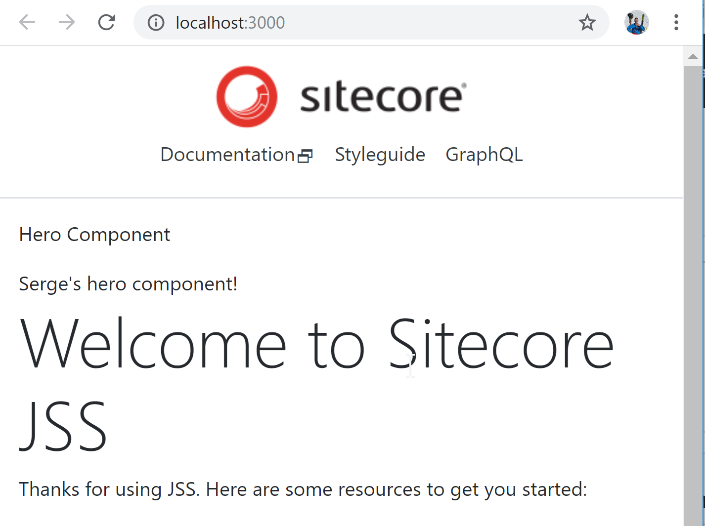

In this blog post I describe my adventures to create a Sitecore 9.1 with JSS project from
scratch. To get started head over to the [Quickstart |Sitecore JSS Documentation](https://jss.sitecore.com/docs/getting-started/quick-start) 
and follow the steps to create a disconnected JSS starter project:

npm install -g @sitecore-jss/sitecore-jss-cli
jss create hello-jss-typescript reactgit init
cd hello-jss-typescript
git init
git add -A
git commit -m "first commit"
git remote add origin https://github.com/macaw-interactive/hello-jss-sitecore.git
git push -u origin master
jss start

We now have the starter website running on http://localhost:3000.

Now we can scaffold a new Hero component using ```jss scaffold Hero```.
The scaffolder generates the new component in it's own folder ```src/components/Hero``` named ```index.js```.
The easy way to introduce TypeScript is described by my colleague Gary Wenneker in his blog post [Sitecore JSS: Get Typed!](https://gary.wenneker.org/sitecore-jss-get-typed/):
- rename the ```Hero.js``` to ```Hero.tsx```
- ```npm install typescript @types/node @types/react @types/react-dom```
- modify the ```tsconfig.json```
- run ```tsc --watch``` to compile the ```.ts``` and ```.tsx``` files to ```.js``` next to the source file

The JSS tooling picks up the ```.js``` component files in the script ```"start:watch-components": "node scripts/generate-component-factory.js --watch"``` for mapping the React components to JSS components. 

Problem with this approach is that source tree is cluttered with generated ```.js``` files 
next to the TypeScript files that are difficult to exclude from source control.

## Another approach in using TypeScript

In this blog post we describe another approach in using TypeScript in you Sitecore JSS project.
The blog post is accompanied by the GitHub repository 
[hello-jss-typescript](https://www.github.com/macaw-interactive/hello-jss-typescript)
with the required modifications for a simple "Hello world" app as a reference for you
adventures.

The first step to execute is to install the required TypeScript tooling
and type definitions: 

```npm install typescript @types/node @types/react @types/react-dom```

Now add a ```tsconfig.json``` file in the root tailered for JSS development.
Because the JSS tool-set is based on the magnificent tool-set of [Create React App](https://facebook.github.io/create-react-app/) we took as a starter point the 
```tsconfig.json``` as generated by ```create-react-app```. We need to make some modifications to tailer it to the needs of the JSS project. Those changes are already
included is the ```tsconfig.json``` below. The rationale behind these changes are described below where appropriate.

```json
{
    "compilerOptions": {
      "target": "es5",
      "allowJs": false,
      "skipLibCheck": false,
      "esModuleInterop": true,
      "allowSyntheticDefaultImports": true,
      "strict": true,
      "forceConsistentCasingInFileNames": true,
      "module": "esnext",
      "moduleResolution": "node",
      "resolveJsonModule": true,
      "isolatedModules": true,
      "noEmit": true,
      "jsx": "preserve",
      "lib": ["es2018", "dom"],
    },
    "include": [
      "src"
    ],
    "types": ["node"]
  }
```

We now scaffold the ```Hero``` component using the command ```jss scaffold Hero``` as
described in [Scaffolding a JSS Component](https://jss.sitecore.com/docs/getting-started/first-component).
This will generate two files:

- ```src\components\Hero\index.js```
- ```sitecore\definitions\components\Hero.sitecore.js```

The generated ```src\components\Hero\index.js``` looks like:

```javascript
import React from 'react';
import { Text } from '@sitecore-jss/sitecore-jss-react';

const Hero = (props) => (
  <div>
    <p>Hero Component</p>
    <Text field={props.fields.heading} />
  </div>
);

export default Hero;
```

rename the file to ```src\components\Hero\index.tsx``` and rewrite the code to:

```typescript
import * as React from 'react';
import { Text } from '@sitecore-jss/sitecore-jss-react';

type HeroPropsFields = {
  heading: {
    value?: string;
    editable?: string;
  } 
}
type HeroProps = {
  fields: HeroPropsFields;
};

type HeroAllProps = HeroProps;

const Hero: React.SFC<HeroAllProps> = (props: HeroAllProps) => (
  <div>
    <p>Hero Component</p>
    <Text field={props.fields.heading} />
  </div>
);

export default Hero;
```

To include the Hero component in a route layout in disconnected mode open the file ```data\routes\en.yml```
and add the Hero component to the ```jss-main``` placeholder:

```yaml
placeholders:
  jss-main:
  - componentName: Hero
    fields:
      heading: Serge's hero component!
  - componentName: ContentBlock
    fields:
```

### Generating the component factory

The component factory does the mapping op React components to JSS components. It provides
the mapping between a string name based on the component folder and name the React component instance.
When the Sitecore Layout service returns a layout definition, it returns the components by name.
Based on the mapping provided by the component factory the component hierarchy can be
constructed for the layout.

The script ```scripts/generate-component-factory.js``` is responsible for the generation of
this mapping and produces the ```componentFactory.js``` output file. We want to use TypeScript for this file because we want the generated import statements also to search for ```.ts``` 
and ```.tsx``` files. must be changed to the ```ts``` extensions. This means that we need to change
the output file to ```componentFactory.ts```. We also want the component factory generation script
to pick up ```.ts``` and ```.tsx``` files so components can be written in both JavaScript and TypeScript. This means that we need to add the following lines to the script:

```javascript
const componentFactoryPath = path.resolve('src/temp/componentFactory.ts');
```
and

```javascript
      fs.existsSync(path.join(componentFolderFullPath, 'index.js')) ||
      fs.existsSync(path.join(componentFolderFullPath, 'index.jsx')) ||
      fs.existsSync(path.join(componentFolderFullPath, 'index.ts')) || // highlight-line
      fs.existsSync(path.join(componentFolderFullPath, 'index.tsx')) // highlight-line
```

Rewriting the JSS tool scripts like ```scripts/generate-component-factory.js``` to TypeScript
as well makes no sense because they are node scripts, and we don't want to introduce a
compilation step in order to run them, although [ts-node](https://github.com/TypeStrong/ts-node) is a viable solution for directly running TypeScript files in a development environment. Another 
reason is that the JSS tool-set calls these scripts.

### Compiling the component factory

On compilation of the ```componentFactory.ts``` file we got the error:

```
Type error: Could not find a declaration file for module '../components/Hero'. 'C:/P/hello-jss-typescript/src/components/Hero/index.js' implicitly has an 'any' type.  TS7016
```

We got similar errors on more files. The easiest way to resolve this is to set the option 
```"noImplicitAny": false``` in the ```tsconfig.json```. This is not a really sustainable option 
because using types instead of ```any``` is the whole purpose of using TypeScript, and settings this 
option means that also the application specific code is not checked if types are omitted. 

Make sure that you don't have an old ```src/temp/componentFactory.js``` file because this file will be picked up in the compilation as well.

We can now run ```jss start``` again and get our TypeScript Hero component working in the disconnected site:



## Getting connected

Now it's time to deploy our JSS app to Sitecore as described in
[JSS Server Setup](https://jss.sitecore.com/docs/getting-started/jss-server-install).

Part of these steps as described in [App Deployment](https://jss.sitecore.com/docs/getting-started/app-deployment) is:

- In IIS add a binding to your Sitecore site for ```hello-jss-typescript.dev.local```
- Add ```127.0.0.1   hello-jss-typescript.dev.local``` to the file ```C:\Windows\System32\drivers\etc\hosts```

After everything is configured we can run ```jss setup``` and answer the questions (you answers may vary):

```
Is your Sitecore instance on this machine or accessible via network share? [y/n]: y
Path to the Sitecore folder (e.g. c:\inetpub\wwwroot\my.siteco.re): c:\inetpub\wwwroot\sc910.sc
Sitecore hostname (e.g. http://myapp.local.siteco.re; see /sitecore/config; ensure added to hosts): http://hello-jss-typescript.dev.local
Sitecore import service URL [http://hello-jss-typescript.dev.local/sitecore/api/jss/import]:
Sitecore API Key (ID of API key item): {57231674-4CC9-48AA-AFF0-190DB9D68FE1}
Please enter your deployment secret (32+ random chars; or press enter to generate one):
Deployment secret has been generated. Ensure the JSS app config on the Sitecore end has the same secret set.
Deploy secret Sitecore config written to C:\P\hello-jss-typescript\sitecore\config\hello-jss-typescript.deploysecret.config
Ensure this configuration is deployed to Sitecore.
JSS connection settings saved to C:\P\hello-jss-typescript\scjssconfig.json

NEXT STEPS
* Ensure the hostName in /sitecore/config/*.config is configured as hello-jss-typescript.dev.local, and in hosts file if needed.
* Deploy your configuration (i.e. 'jss deploy config')
* Deploy your app (i.e. 'jss deploy app -c -d')
* Test your app in integrated mode by visiting http://hello-jss-typescript.dev.local
```

As specified in the ```NEXT STEPS``` we should deploy the configuration using ```jss deploy config```
and deploy the app using ```jss deploy app -c -d```.

When we deploy the app we get a compilation error in building the ```server.bundle.js```:

```
ERROR in ./src/AppRoot.js
Module not found: Error: Can't resolve './temp/componentFactory' in 'C:\P\hello-jss-typescript\src'
 @ ./src/AppRoot.js 5:0-55 32:22-38
 @ ./server/server.js
```

Because ```server/server.js``` does an import of ```AppRoot``` from ```../src/AppRoot``` and 
```AppRoot``` does an import of ```./temp/componentFactory``` which is generated as a 
TypeScript file we have an issue. This can be fixed by renaming ```server/server.js```
to ```server/server.tsx``` and modifying ```server/server.webpack.config.js``` to have as
entry ```entry: path.resolve(__dirname, './server.tsx')```. Because the server bundle specific 
webpack configuration file does a require of ```babel-preset-react-app``` it can use the
Babel 7 configuration to compile TypeScript files out of the box.

Next step is to rename the file ```src/AppRoot.js``` to ```src/AppRoot.tsx```. This is the main
entry point of the app invoked by the renderer for server and client rendering. It imports
the generated ```src/temp/componentFactory``` file, but we can't import a ```.ts``` file
from a ```.js``` file. It won't be resolved.

Strangely I has issues with awesome-typescript-loader, so I used ts-loader in ```server/server.webpack.config.js```.

Including the content of the above described files will make this blog post too large, so please refer 
to the GitHub repository [hello-jss-typescript](https://www.github.com/macaw-interactive/hello-jss-typescript)
for the details.

If we now the app using ```jss deploy app -c -d``` we can navigate to http://hello-jss-typescript.dev.local/ and
the site is rendered correctly.

This is just the first step... all app specific code must be rewritten in TypeScript. I will keep you posted.

Interesting stuff to investigate in this context:

- [FR: Generate Typescript Typings from Manifest](https://github.com/Sitecore/jss/issues/74)