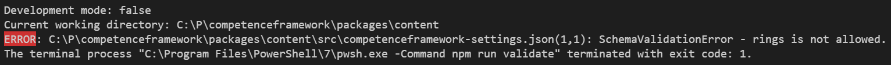
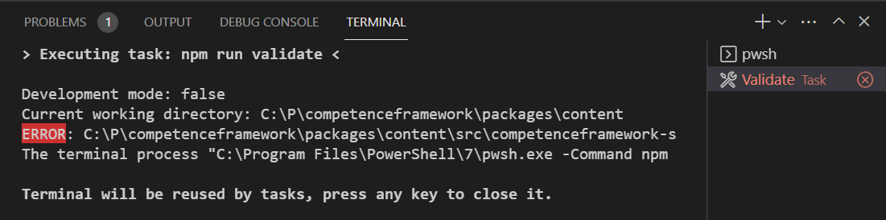
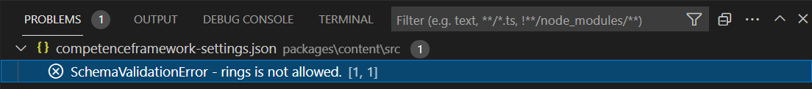

Assume you have a Node.js script that validates your content for problems. It is nice to have some output to indicate these errors. For example as follows:



To identify that there is a problem (error or warning) it is possible to color the problem type, for example with the [chalk](https://github.com/chalk/chalk#readme) library. I use a few simple functions to create these messages which I write to the output using console.log().


createWarningOrErrorString.ts: (note, this is TypeScript)
```typescript
import * as path from "path";
import chalk from "chalk"; // use version 4 for TypeScript, until TypeScript 4.6 is available

export function createErrorString(message: string, errorType: string, filepath = "", line = 1, column = 1): string {
    const filepathString = filepath === "" ? "<nofile>" : path.join(process.cwd(), filepath);
    const errorMessage = `${chalk.bgRed("ERROR")}: ${filepathString}(${line},${column}): ${errorType} - ${message}`;
    return errorMessage;
}

export function createWarningString(message: string, errorType: string, filepath = "", line = 1, column = 1): string {
    const filepathString = filepath === "" ? "<nofile>" : path.join(process.cwd(), filepath);
    const warningMessage = `${chalk.bgYellow("WARNING")}: ${filepathString}(${line},${column}): ${errorType} - ${message}`;
    return warningMessage;
}
```

Assume we have an npm script validate as follows (where in  my case `validate.js` is transpiled from `validate.ts`):

```
   "scripts": {
       "validate": "node validate.js"
   }
```

If we run `npm run validate` in a terminal window within VSCode we get the output including the error and warning messages, but they will not end up in the "Problems" panel is Visual Studio Code.

There are two reasons for that:

1. Visual Studio Code does not parse the output of commands executed in a terminal window
2. If custom errors and warnings are generated by the validate script, VSCode does not know how to parse these errors and warnings.

The solution to both problems are VSCode tasks.

A VSCode task is executed in a separate terminal task tab, named after the executing task:



The nice thing is that VSCode parses the output generated in this tab for problems.

But first we need to define a VSCode task for this:

.vscode/tasks.json:

```

{
    "version": "2.0.0",
    "tasks": [
        {
            "label": "Validate",
            "detail": "Validate all content and parse errors from output",
            "type": "npm",
            "script": "validate --silent",
            "problemMatcher": [
                {
                    "owner": "content-linter",
                    "fileLocation": ["autoDetect", "${workspaceFolder}"],
                    "pattern": {
                        "regexp": "^(ERROR|WARNING):\\s*(.*)\\((\\d+),(\\d+)\\):\\s+(.*)$",
                        "file": 2,
                        "line": 3,
                        "column": 4,
                        "severity": 1,
                        "message": 5
                    }
                }
            ],
            "options": {
                "statusbar": {
                    "label": "$(check-all) Validate",
                    "color": "#00FF00"
                }
            }
        }
    ]
}
```

Note that the above task configuration parses the errors/warning in the output, to show them in the "Problems" panel. So the line:

```
C:\P\competenceframework\packages\content\src\competenceframework-settings.json(1,1): SchemaValidationError - rings is not allowed.
```

Is parsed using the regular expression `^(ERROR|WARNING):\\s*(.*)\\((\\d+),(\\d+)\\):\\s+(.*)$`.

Resulting in the following information in the "Problems" pane:



To run this task execute the task, press F1, select `Tasks: Run Task`, and next select the `Validate` task.

Note that the above task configuration contains some addition information in options. This drives the configuration of a VSCode extension [Tasks](https://marketplace.visualstudio.com/items?itemName=actboy168.tasks) to add tasks in the VSCode status bar:


I the above example I created two tasks in the status: `Validate` and `Build`.

Now you can start your tasks with a single click, parse the output, and show the results in the "Problems" pane.

Normally the "Problems" pane only shows problems in open files, but using tasks you can report on all problems that occured during the execution of the task.

VSCode has [great documentation on tasks](https://code.visualstudio.com/docs/editor/tasks). Check it out!
