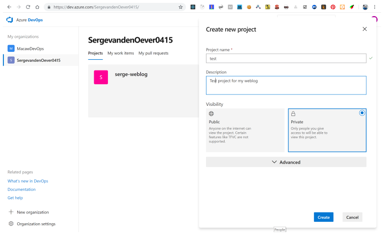
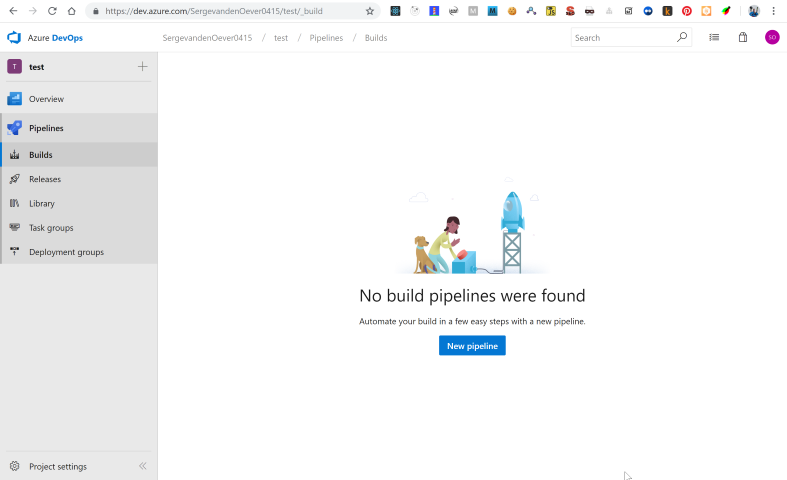
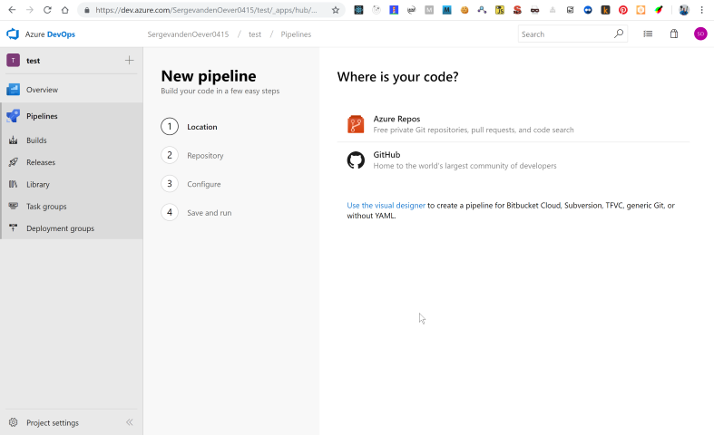
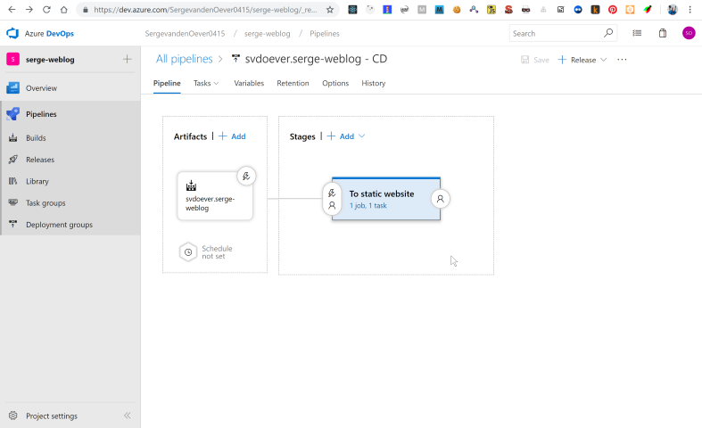
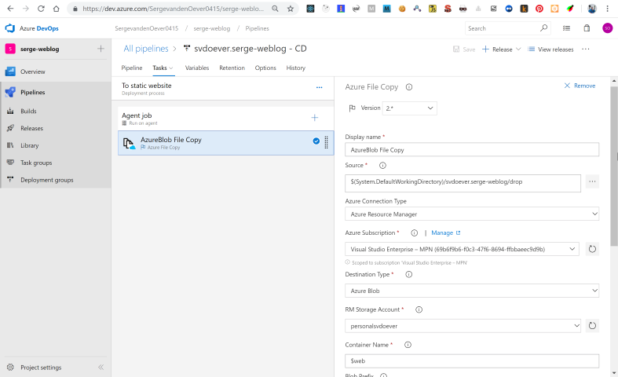

My  weblog is hosted in a Git repository on Github. Github is bought by Microsoft, and now Github provides integration with Azure and its pipelines for build and deploy. This integration can be enabled through the [Azure Pipelines app](https://github.com/marketplace/azure-pipelines) at the Github marketplace.

After setting up and configuring the Azure Pipelines app for your Github account move over to https://dev.azure.com. In the new configured Azure DevOps organization you can setup new projects.



There are no build pipelines configured yet.



When creating a new build pipeline the first question is: where is your repo. In my case the repo is hosted on Github.



Authorize yourself, and select the repository to use in the deployment. The final step is to configure the build pipeline. This is done though a YAML file called ```azure-pipelines.yml``` that will be stored in the root of the Github repository. Because the project to deploy is a Node application the information in the documentation
[Build, test, and deploy JavaScript and Node.js apps in Azure Pipelines](https://docs.microsoft.com/en-us/azure/devops/pipelines/languages/javascript?view=vsts&tabs=yaml) describes the possible configuration settings that can be made.


azure-pipelines.yml:
```yaml{}
trigger:
- master

pool:
  vmImage: 'Ubuntu-16.04'

steps:
- task: NodeTool@0
  inputs:
    versionSpec: '10.x'
  displayName: 'Install Node.js'

- script: |
    npm install
    npm run azure-build
  displayName: 'npm install and build'

- task: PublishBuildArtifacts@1
  inputs:
    PathtoPublish: '$(System.DefaultWorkingDirectory)/public'
```

In the above build pipeline configuration there are a few important elements:

1. The script tag does an ```npm install``` and an ```npm run azure-build``` which actually just calls ```gatsby build```. The result of this build is a static website with all blog posts in the folder ```public```.
2. The ```PublishBuildArtifacts``` tasks selects as path to publish only the contents on this public folder. Note that if the resulting artifacts a folder ```drop``` is created containing the contents of the public folder.

We now have a build result which must be deployed. The website is deployed as a static website on an Azure storage account, as described in the documentation [Static website hosting in Azure Storage](https://docs.microsoft.com/en-us/azure/storage/blobs/storage-blob-static-website). Important for the next step is that when you create a static website on the storage (only one static website per storage account), the website is stored in the container ```$web```. In the case of my weblog the resulting website is [https://personalsvdoever.z6.web.core.windows.net](https://personalsvdoever.z6.web.core.windows.net).

The following step is the release pipeline for deployment of the build artifacts to the the static website.



This release pipeline is triggered by a new build result, and requires only one task in the stage that is renamed to **To static website**.



Import in the configuration of the **Azure File Copy** task is that the we need to take the source files from the ```drop``` folder and copy them to the container ```$web```.

One issue with the static web sites on Azure storage is that they support http only. This can be solved using an Azure CDN as described in [Tutorial: Use Azure CDN to enable a custom domain with SSL for a static website](https://docs.microsoft.com/en-us/azure/storage/blobs/storage-blob-static-website-custom-domain).

My first take on selecting a CDN was taking the Microsoft standard
CDN. The issue that I faced was that when I updated an article the
CDN did not reflect these changes. Expiration of items on the CDN
are controlled by `Cache-Control` headers as explained in the
article [Manage expiration of web content in Azure CDN](https://docs.microsoft.com/en-us/azure/cdn/cdn-manage-expiration-of-cloud-service-content). Because I'm running from a static web site hosted on Azure blob
storage I don't have a web server in between where I can control
these headers like I can do on for example IIS. The other CDN
offerings on Azure (Verizon, Akamai) give you more control to 
override caching based on for example file extensions. I first tried
the Verizon offering which let you control these settings in a 
separate and incomprehensible "manage" interface. After struggling
for a while I tried the Akamai offering of the CDN which has the
Azure management screens as described in the above mentioned article
so I could make all pages cache for 1 minute except for .js, .css 
and .json files which get a new unique url after each site 
generation and can be cached fr a year.  


The CDN for this weblog is running on [https://svdoever.azureedge.net](https://svdoever.azureedge.net). The custom domain name [www.sergevandenoever.nl](https://www.sergevandenoever.nl) points to this url.


